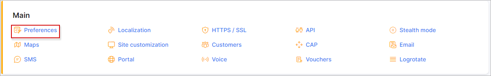

Preferences
==========

Basic settings of the administrator's and customer's portal can be configured under `Config → Main → Preferences`.

## Default landing page
Here you can select which page(customer or admin portal) will be opened when visiting your Splynx url https://yourSplynx.com :

## Administration portal

The following settings are for the admin portal only.

* **Title for admin pages** - header for the tab name in browsers(Splynx: Preferences, Splynx: Dashboard);
* **Logo** - default code for the admin portal logo. The size of the logo, and  other parameters can be set here;
* **Reset password** - enables/disables the option to reset the password for the admin portal;
* **Code validity** - how many hours the code for resetting the password is valid;
* **Attempts limit** - how many attempts the password can be changed during the code validity period;
* **Type of resetting password** - select which method to reset password (via Email or SMS);
* **Template for email message** - select the template for the email message to reset the password;
* **Template for SMS message** - select the template for the SMS message to reset the password;
* **Text for SMS message** - type the text for the SMS message with the code;
* **Characters for generate email check code** - the list of characters available for generating the code via email;
* **Email check code length** - specify the length of the code for the email option;
* **Characters for generate SMS check code** - the list of characters available for generating the code via SMS;
* **SMS check code length** - specify the length of the code for the SMS option.

## Customer portal

Only the style for the customer portal logo can be changed here.

## Server side data table processing

* **Enable processing** - enables/disables server processing in the customer list and finance sections;
* **Rule counter for server-side processing** - the number of records after which server side data table processing will be enabled;
* **Search delay** - search delay in milliseconds.

## Documentation

Please do not change this field. It is used to load in-built documentation.

## Map settings

Configurations for Maps are done here:

* **Map type** - select the map type: Openstreet, GoogleMaps or BingMap(OpenStreet is not required any configuration);
* **Google Maps API key (Restricted for domain)** - if the map type selected is GoogleMaps, enter the API key here for the restricted domain. [Guide how to get Maps API key](https://developers.google.com/maps/documentation/javascript/get-api-key)
* **Google Geocode Javascript API Key (Restricted for IP)** - if the map type selected is GoogleMaps, enter the JavaScript API key here restricted for the IP (IP of Splynx server). [Guide how to get JavaScript API key](https://developers.google.com/maps/documentation/javascript/get-api-key);
* **Google geocoding** - geocoding format used for Google Maps;
* **Bing Maps API key** - If BingMap is selected as the type of map, enter the Bing API key here. [Manual here](https://docs.microsoft.com/en-us/bingmaps/getting-started/bing-maps-dev-center-help/getting-a-bing-maps-key);
* **Bing geocoding** - geocoding format used for Bing Maps;
* **OpenStreet geocoding** - geocoding format used for OpenStreet maps.

## Auto backup settings

The following are the settings for the auto backup feature.

* **Enabled** - enables/disables auto backup;
* **Period** - select the period for auto backups(Month, Week, Day);
* **Password** - specify a password for auto backups;
* **Prefix** - the prefix for auto backup files;
* **Categories for backup** - select what data to backup(database, rrd files, templates, addons and handlers, uploads);
* **Rotation amount** - counter of auto backups for storage.

## Mention notifications

* **Enable mentions notifications** - enables/disables mentions notifications;
* **Subject** - subject of the notification message;
* **Template** - template for the notification body.

## Mention group notifications

* **Enable group mentions notifications** - enables/disables group mentions notifications;
* **Subject** - subject of the notification message;
* **Template** - template for the notification body.
