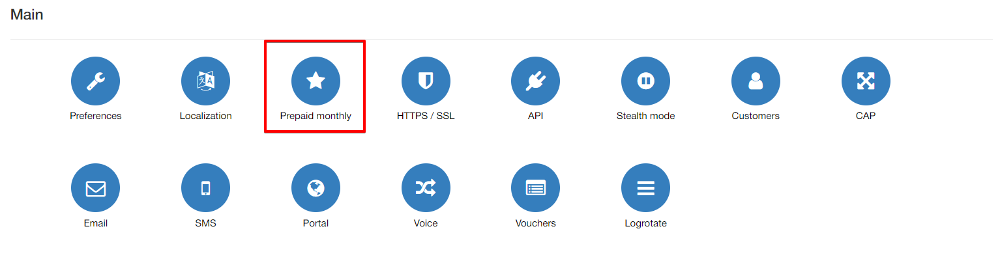
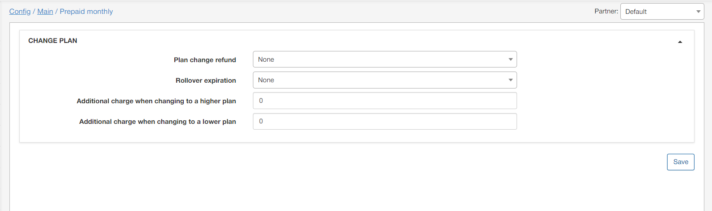

Prepaid Monthly
===============

In this sections, elements of your prepaid monthly plans/services can be configured.

These settings can be customized for each partner on the system. Simply select the partner to work with at the top right corner of the page.

**Parameter descriptions**:

* **Plan change refund** - select the type of refund to give customers when performing a change plan, options are: *None, Rollover unused dat or Rollover unused money*

* **Rollover expiration** - specify how many months rollover data is valid for.

* **Additional charge when changing to a higher plan** - specify the amount of funds to charge extra for when a customer changes to a tariff plan with a higher cost and/or data.

* **Additional charge when changing to a lower plan** - specify the amount to charge extra for when a customer changes to a tariff plan with a lower cost and/or data.
