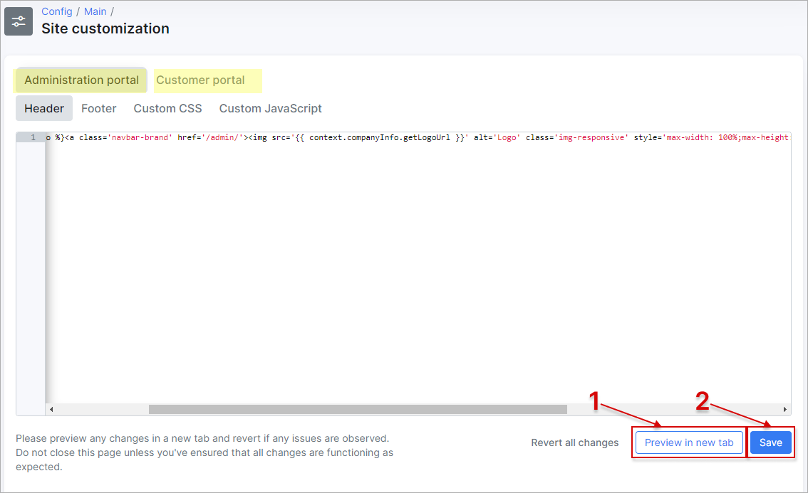
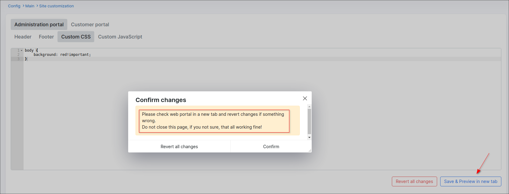

Site customization
==========

You can configure the default view of the administrative and customer portal of your Splynx here. In particular, can be changed/applied the **Header**, **Footer**, **Custom CSS** and **Custom JavaScript**.



The default code for **Header**:

```
<a class='navbar-brand' href='/admin/'> </a><a class='navbar-brand' href='/admin/'>Splynx</a>

```

The default code for **Footer**:

```
Powered by <a href='https://splynx.com/' target='_blank'>Splynx</a>

```

After you make any changes in the code block, press **Save & Previw in new tab** button to double check if Splynx works correctly. The Splynx Dashboard page will be opened in 2 sec as a new tab where you can check the result.
If the page is corrupted, you still have an active tab with the **Revert all changes** button to undo the latest changes.

**Do not close this page until you can verify that everything is working correctly**.


