SMS config
=========

Splynx ISP Framework supports sending of notifications and reminders to customers via SMS. For the configuration of SMS gateway you need to find a local SMS gateway and set up Splynx to work with that getaway.

To configure SMS sending in Splynx click on `Config→Main→SMS`.

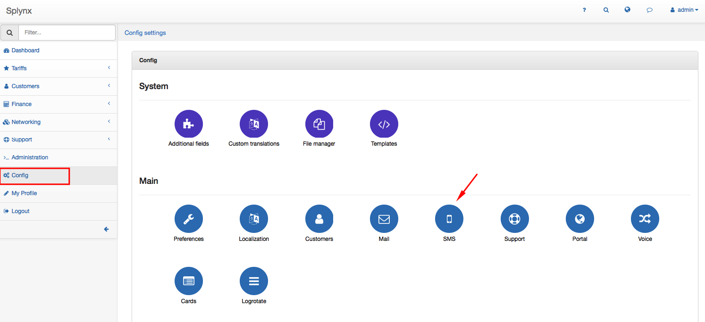


You can set here the following SMS parameters:
Main
* **Gateway URL** - insert URL for sending SMS
* **Params** - Params for request of sending SMS (use patterns %TO% and %MESSAGE% for relevant values).
* **Method** - choose method to call gateway (POST or GET)
* **Content type** - how to handle Params (json or x-www-form-urlencoded).
* **Enable SMS sending** - enable this option when is desirable to send SMS from pool
* **Debug** - you can enable debug to log file
* **Successful response** - you can text here to check response from gateway
* **Days to expire** - choose how many days server will try to send the email

For example, we will use https://www.smsapi.com as a service to send SMS. So we should register there, after that we can access the dashboard:

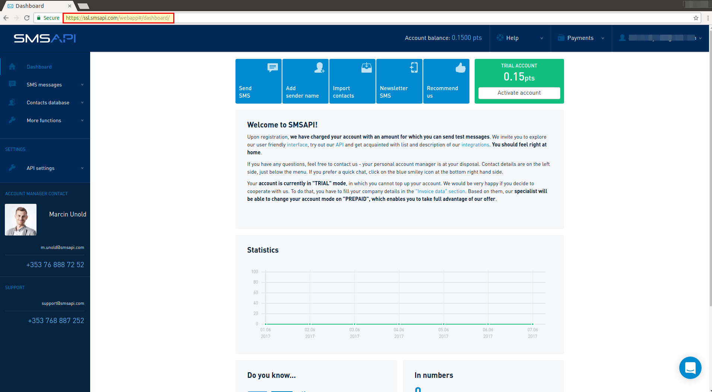

And now, we have to see API documentation:


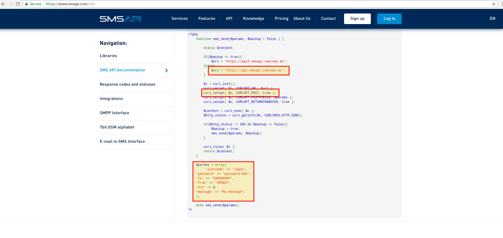

As you can see in previous screenshot, in "params" it used "password" in MD5-format. To receive that password we have to go https://www.smsapi.com in dashbord and set API password:

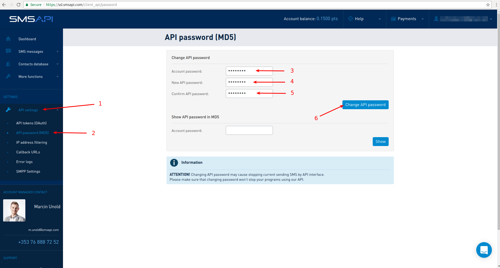


Everything is ready to configure Splynx system. All data: Gateway URL, Params and Method we take from "API documentation".


Field **Params** should be:
```
username=insert_smsapi.com_username&password=insert_password_in_MD5_format&from=Info&to=%TO%&message=%MESSAGE%
```

Field **Successful response** should be "OK:", as you can see on next screenshot, when we received response from smsapi-system.

Then, click "Run test" button and see "Test result".


#### Test

* **Phone** - you can add here a phone number to run a test

If everything is Ok, click "Save" button to save SMS-configuration.


That is all. System is fully configured. And now let's see an example, how to send SMS to the current customer. Open customers list, choose some customer and check his phone number:

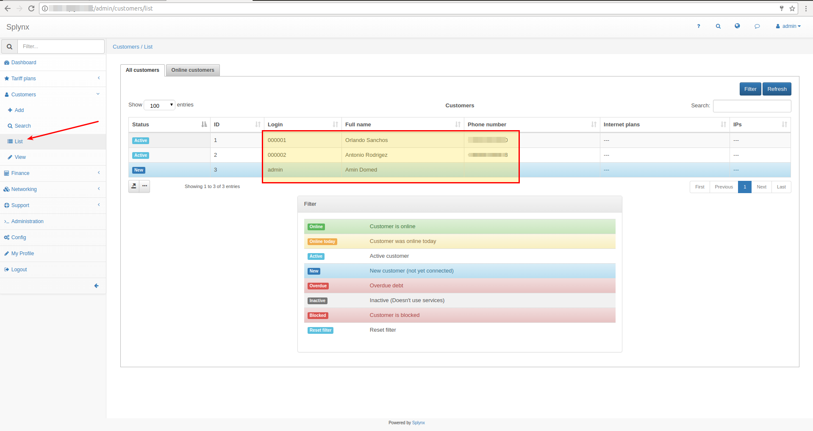

Then, we will create SMS message:

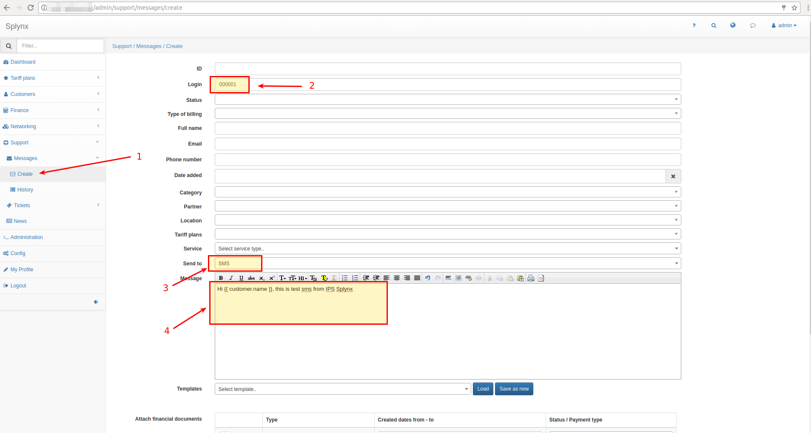

after that we can preview message and send it:

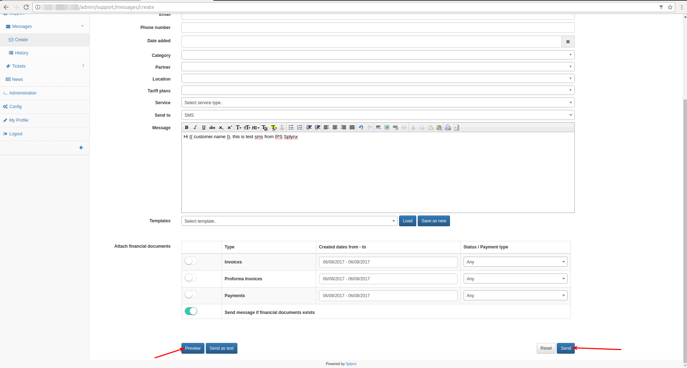

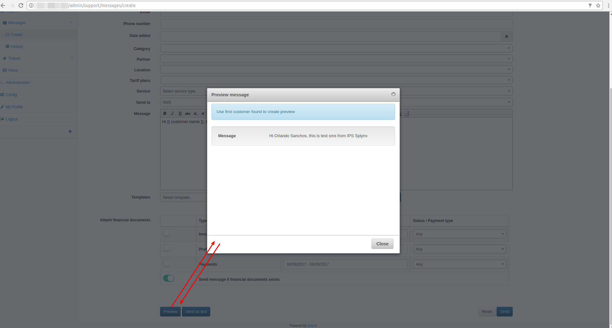

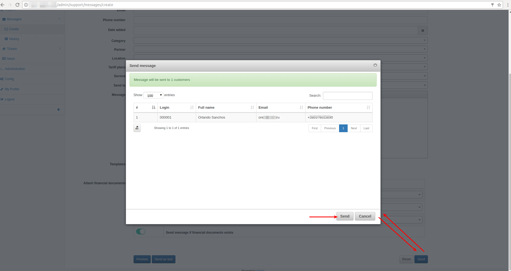

The same information you can also find in our video tutorial - https://splynx.com/235/configure-sms-in-ispframework/.


----
## SMS gateway me
If you want to use your own phone to send SMS, you can use the service https://smsgateway.me

In the [official documentation](https://smsgateway.me/sms-api-documentation/getting-started), you can find all the steps necessary for the initial configuration of the service.


After installing the application into the phone and settings, your device appears in the list of devices.

***Remember his ID***


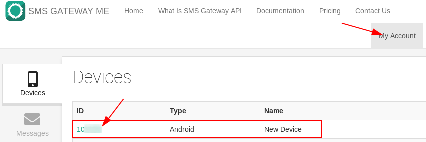

Next you need to get API token, ***copy it***.

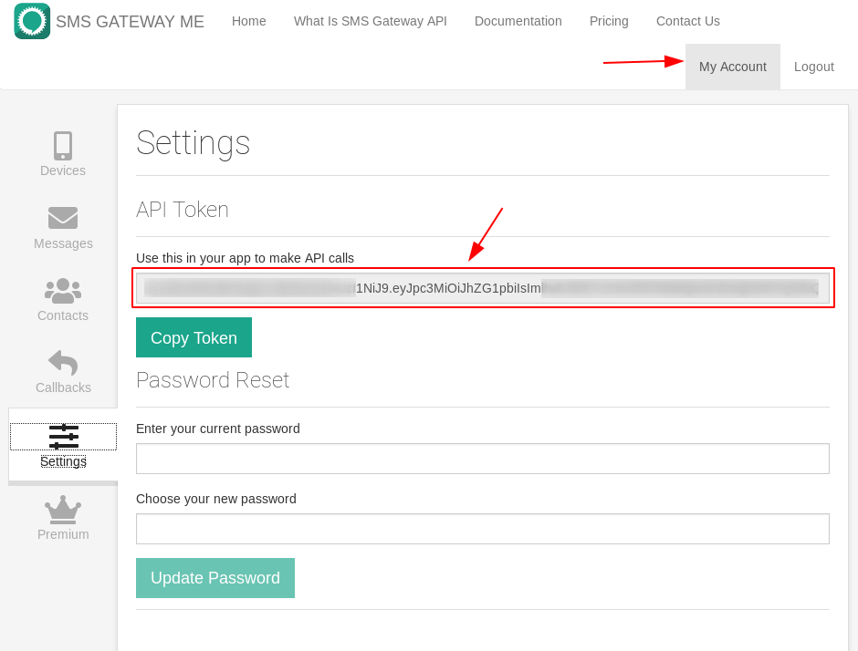

Next switch to the splynx and fill in the required fields:
* **Gateway URL** -  https://smsgateway.me/api/v4/message/send
* **Payload** - [{"phone_number": "%TO%", "message": "%MESSAGE%", "device_id" : *<use_your_device_ID>*}]
* **Method** - POST
* **Content type** - json
* **Enable SMS sending** - 
* **Successful response** - OK
* **Custom header/Name** - Authorization
* **Custom header/Value** - *<paste_your_api_token>*

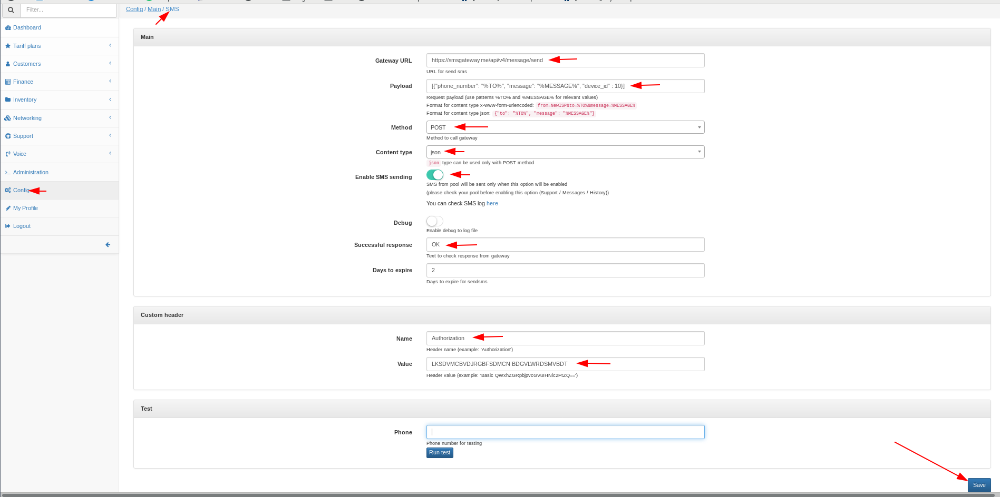


That's all, you can specify the number of your mobile, click on the test button and check the operability.

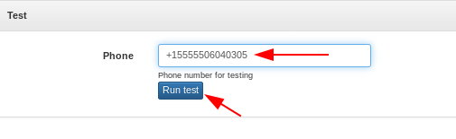
