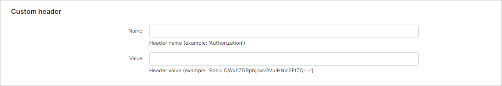
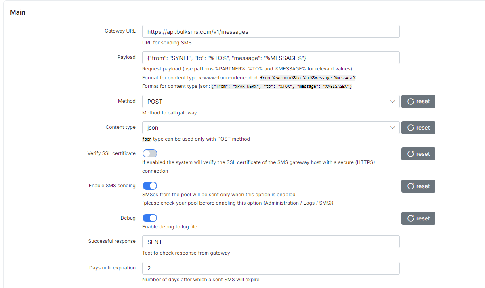
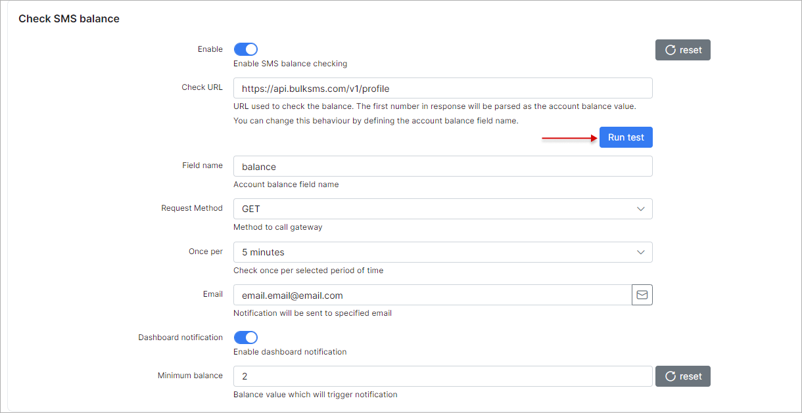
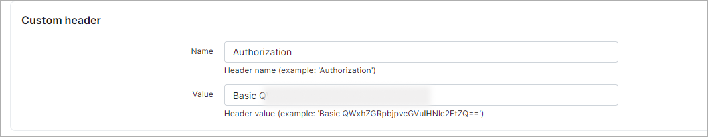

SMS sending configuration
=========

Splynx supports sending of SMS's using the different SMS gateways. To configure SMS sending you need to find a suitable SMS gateway and set up Splynx to work with it.

To configure SMS sending in Splynx navigate to `Config → Main → SMS`.


**NOTE: The configuration will be unique for each SMS gateway.**

The **SMS logs** can be found in [`Administration → Logs → SMS`](administration/logs/sms/sms.md) or in [`Messages → Mass sending → History`](support_messages/sms_messages/sms_messages.md).


### Main
* **Gateway URL** - specify the URL of the SMS gateway (should be specified in gateway documentation);
* **Payload** - request payload for sending SMS. Depends on content type (*JSON* or *x-www-form-urlencoded*) and syntax provided by SMS gateway;
* **Method** - select the method to call the gateway (*POST* or *GET*);
* **Content type** - how to handle the payload (*JSON* or *x-www-form-urlencoded*). **JSON can be used only with POST method**;
* **Verify SSL certificate** - If the toggle is enabled the system will verify the SSL certificate of the SMS gateway host with a secure (HTTPS) connection;
* **Enable SMS sending** - enables/disables SMS sending from Splynx;
* **Debug** - enable/disable the writing of debugging information to the log file `/var/www/splynx/logs/cron/sms.log`;
* **Successful response** - if the SMS gateway returns a certain successful response, the text to check response from gateway must be configured here so that Splynx can identify which SMS was sent;
* **Days to expire** - how many days the server will try to send the SMS. After that the message status will be changed to "Error".


### Check SMS balance


* **Enalbe** - enable/disable the SMS balance checking;
* **Check URL** - specify the URL which is used for checking SMS balance, it should be specified in gateway documentation (the first number in response will be parsed as the account balance value. You can change this behavior by defining the account balance field name in the field below;
* **Field name** - name of the field with the account balance;
* **Requested method** - select the method to call the gateway (*GET* or *POST*);
* **Once per** - check balance every selected period of time (*5 min*, *hour*, *day*);
* **Email** - result will be send to this email;
* **Dashboard notification** - enables/disables notifications with SMS account balance on the dashboard;
* **Minimum balance** - balance value at which the notification is triggered.


### Custom header

The header is used for authentication. It can be either the *username* you supplied when you registered on your SMS gateway service or an *API Token*.

To know how to use these values correctly, always double-check the SMS gateway documentation.

The **examples** of custom headers:



or


### Test


* **Phone** - the target phone number to send a test SMS to. Sometimes `+` sign must be added before the actual number (full format of the phone number for your country).


------------


<details>
<summary><b>Example of Bulk SMS gateway configuration</b></summary>
<p markdown="1">


1. First of all, you need to have a valid account on https://www.bulksms.com/ and configure API Token to connect it with Splynx - [Register your BulkSMS account](https://www.bulksms.com/account/#!/registration);


2. On BulkSMS account page, navigate to `Settings → Advanced` and press **Create Token** button, type the name to your token. In a new window will be shown once only the credentials to your token, copy and save them.


3. To **request sender id** which will be shown in SMS for your customers, navigate to `Settings → Message` and click on *Sender IDs* tab.

**NOTE:** You must have purchased credits at least once before you can use this facility.


4. In Splynx, navigate to `Config → Main → SMS` <br>

In **Main** section configure the following settings:


<details>
<summary><b>The values example</b></summary>
<p markdown="1">


**Gateway URL:**

```
https://api.bulksms.com/v1/messages
```

**Payload:**

```
{"from": "YourSenderID", "to": "%TO%", "body": "%MESSAGE%"}
```


</p>
</details>





In **Check SMS balance** section configure the next settings:



Press **Run test** button to check the balance, the result will be shown in **Test result** area at the bottom of the page.


In **Custom header** section use the generated `Basic Auth` value from **step 2**:




5. In **Test** section, type your test phone number to check the SMS configuration


More information you can find in these articles:


[BulkSMS JSON REST API (v1.0.0)](https://www.bulksms.com/developer/json/v1/#)

[BulkSMS generic error types](https://www.bulksms.com/developer/json/v1/errors/)


</p>
</details>


<details>
<summary><b>Example of Clickatell SMS gateway configuration</b></summary>
<p markdown="1">


For more information, see:

- https://www.clickatell.com/products/sms-platform

- https://docs.clickatell.com/channels/sms-channels/sms-api-documentation/

</p>
</details>


<details>
<summary><b>Example of BurstSMS SMS gateway configuration</b></summary>
<p markdown="1">


For more information, see:

- https://burstsms.com.au/sms-api


</p>
</details>


We have a special topic on our forum where you can find a suitable SMS gateway and find out which gateways can't be used in Splynx:

- https://forum.splynx.com/t/sms-gateway-sharing-recommendations/1963 .
