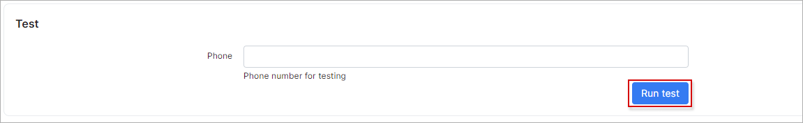

SMS sending configuration
=========

Splynx supports sending of SMS's using different SMS gateways. To configure SMS sending you need to find a suitable SMS gateway and set up Splynx to work with it.

To configure SMS sending in Splynx navigate to `Config → Main → SMS`.

**NOTE! Configuration will be unique for each SMS gateway.**

**SMS logs can be found under [`Administration - Logs - SMS`](administration/logs/sms/sms.md) or under `Support - Messages - History`**

Example of [Clikatell SMS gateway](https://www.clickatell.com/) configuration:

Example of [BurstSMS SMS gateway](https://burstsms.com.au/sms-api) configuration:

## Main
* **Gateway URL** - specify the URL of the SMS gateway(should be specified in gateway documentation);
* **Payload** - request payload for sending SMS. Depends on content type(JSON or x-www-form-urlencoded) and syntax provided by SMS gateway;
* **Method** - select the method to call the gateway (POST or GET);
* **Content type** - how to handle the payload (JSON or x-www-form-urlencoded). JSON can be used only with POST method;
* **Enable SMS sending** - enables/disables SMS sending from Splynx;
* **Debug** - enables/disables debug to log file */var/www/splynx/logs/cron/sms.log*;
* **Successful response** - if the SMS gateway returns a specific successful response it should be configured here so that Splynx can know which SMS was sent;
* **Days to expire** - how many days the server will try to send an SMS. Thereafter it will be marked as "Error".

## Check SMS balance
Example of check SMS balance config using [Clikatell SMS gateway](https://www.clickatell.com/)

* **Enalbe** - enables/disables checking SMS balance;
* **Check URL** - specify the URL which is used for checking SMS balance(should be in gateway documentation);
* **Field name** - name of the field with the account balance;
* **Requested method** - select the method to call the gateway(GET or POST);
* **Once per** - check balance every selected period of time;
* **Email** - result will be send to this email;
* **Dashboard notification** - enables/disables notifications with SMS account balance on the dashboard;
* **Minimum balance** - balance value which will trigger the notification.

## Custom header
Sometimes it is needed for the configuration of SMS sending. Whether it should be used or not will be described in the SMS gateway documentation.

Few examples of custom headers are listed below:

OR

## Test

* **Phone** - the target phone number to send a test SMS to. Sometimes "+" must be specified before the actual number (full format of the phone number for your country).

We have a special topic on our forum where you can find a suitable SMS gateway and find out which gateways can't be used in Splynx: https://forum.splynx.com/t/sms-gateway-sharing-recommendations/1963/8
