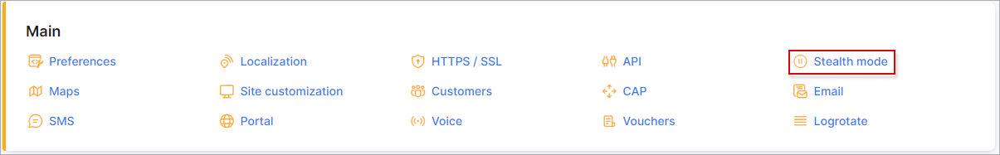
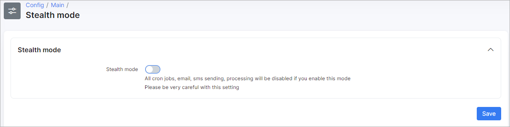

Stealth mode
=====

This feature can be used after server migration(on a new server) when the old and new server are online to avoid sending emails/sms duplicates, duplicated statistic etc.

* **Stealth mode** - enables/disables this mode, which means that cron jobs, email, sms sending, processing will be disabled if you enable this mode. Please be very careful with this setting
