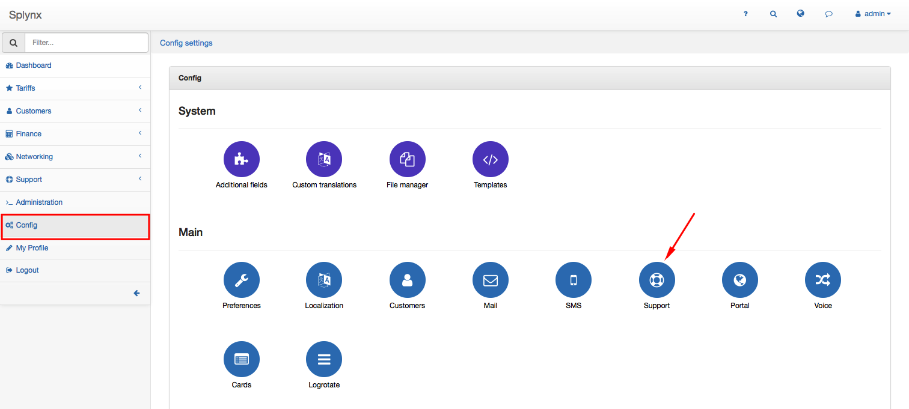
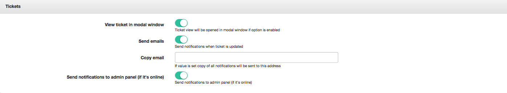
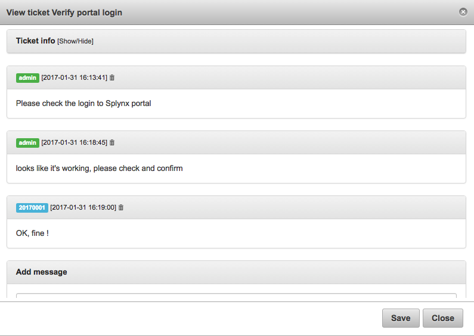
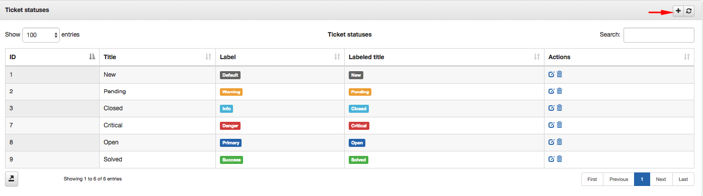
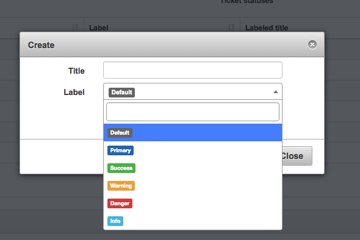
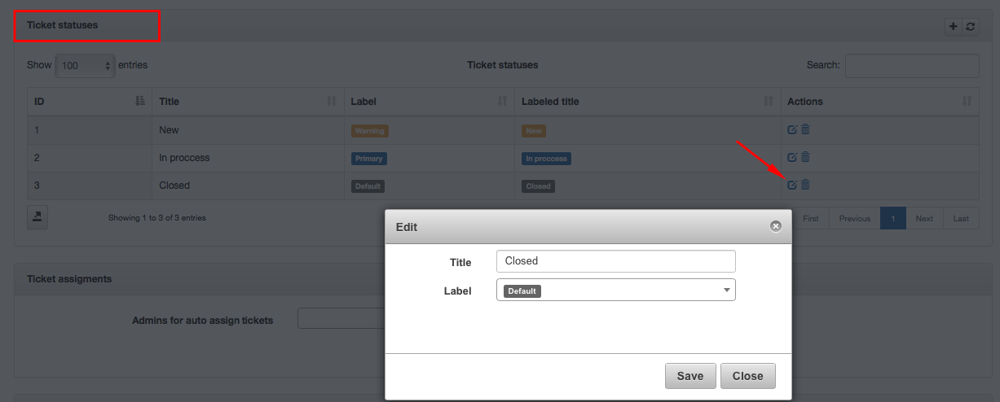
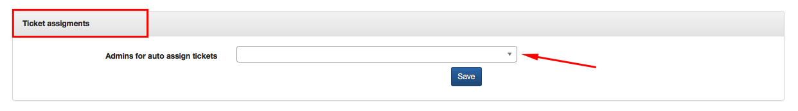
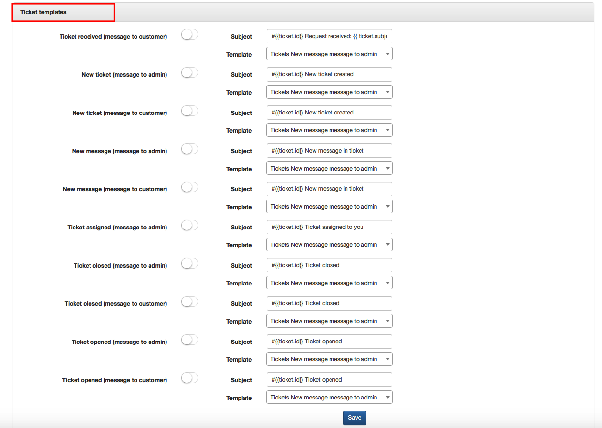

Support
=======

To configure your ticketing system click on `Config → Main → Support`.

The support is divided into four areas:

### Tickets

* **View ticket in modal window** -  It is possible to choose to see the ticket in modal window by enabling this option.

  

* **Send emails** - It is possible to send an email notification every time when the ticket is updated by turning this option on <icon class="image-icon"></icon>
* **Copy email** -  you can use an additional email in Copy email if you want to add a Carbon Copy.
* **Send notifications to admin panel** (if it's online) - if option is enabled, notifications will be send to admin panel.

The mail configuration is explained in [Email config](configuration/main_configuration/email_config/email_config.md).

### Ticket statuses

It is possible to create new statuses by clicking on the plus above the table.

A window will pop up where you will write a Title of the new status. For every status you can define a label with a different color: *Default, Primary, Success, Warning, Danger, Info*.

You can edit or delete existing statuses be clicking on icons <icon class="image-icon"></icon> and <icon class="image-icon"></icon> option in the "Actions" column of the table.

### Ticket assigments

When customer has created the ticket, it is possible to auto assign the ticket to a particular administrator on default.

### Ticket templates

You can set parameters of ticket templates here.

