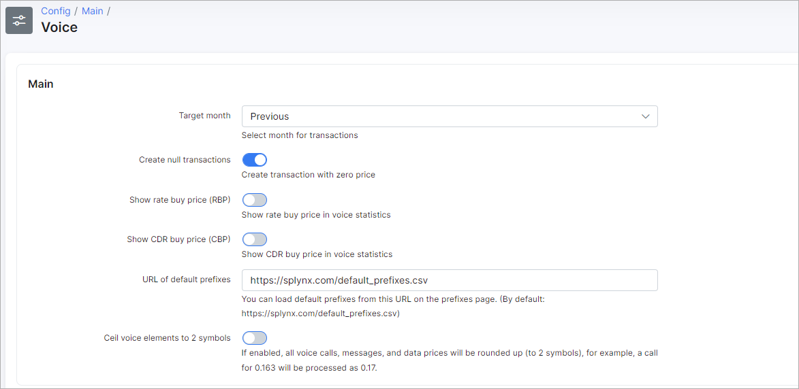
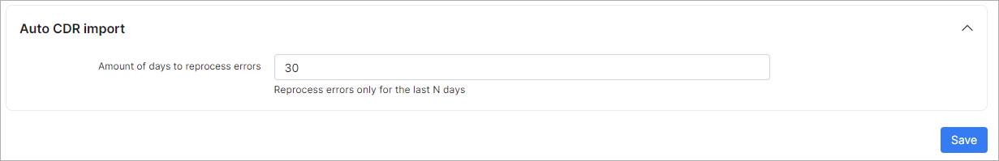

Voice
=====

Elements of the voice module can be configured here.

## Main
* **Target month** - target month for voice calls charges. Best practice us to keep it to "Previous";
* **Create null transactions** - enables/disables the creation of transactions with zero price;
* **Show rate buy price (RBP)** - enables/disables the displaying of the buy price in voice statistics;
* **Show CDR buy price (CBP)** - enables/disables the displaying of the CDR buy price in voice statistics;
* **URL of default prefixes** - default prefixes can be loaded from this link;
* **Ceil voice elements to 2 symbols** - if enabled, all voice calls, messages, and data prices will be rounded up (to 2 symbols).

## Auto CDR import
* **Amount of days to reprocess errors** - how many days auto CDR imports will try to reprocess errors.
