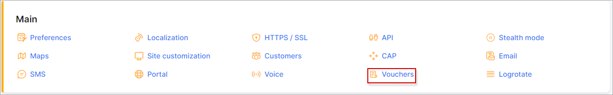
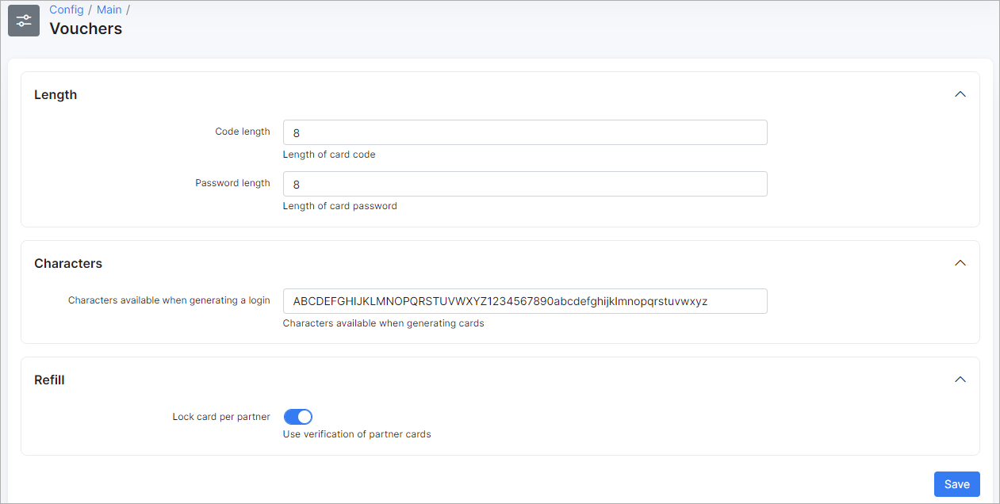

Vouchers
=====

Elements of Vouchers can be configured here.

## Length

* **Code length** - specify the length of the code;
* **Password length** - specify the length of the password.

## Characters
* **Characters available when generating login** - specify the list of characters that will be used for login generation.

## Refill
* **Lock card per partner** - enables/disables locking cards per partner.
