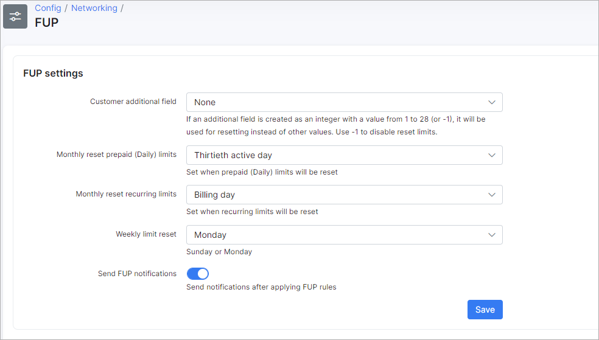

FUP
====

FUP settings are configurable under `Config → Networking → FUP`:

The following FUP settings can be configured:

* **Customer additional field** - you can select the customer additional field here. If an additional field is set and is an integer from 1 to 28 (or -1), it will be used for resetting instead of other values. Use -1 value to disable reset limits.

* **Monthly reset prepaid (Daily) limits** - set the day to reset prepaid limits;

* **Monthly reset recurring limits** - set the day to reset recurring limits;

* **Weekly limit reset** - choose Sunday or Monday to reset limits weekly;

* **Send FUP notifications** - enables/disables sending of FUP notifications after applying FUP rules.
