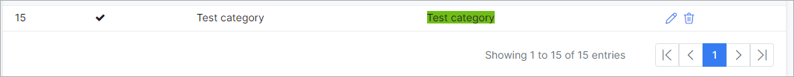

IP Host categories
=================

To configure IP Host categories navigate to `Config → Networking → IP Host categories`:

It is possible to add, edit or delete IP Host categories here:

When you edit an existing IP Host category, you can change the name of the Category, the Icon and the color used:

You can see all available icons and their names on the following page: [Fontawesome](http://fontawesome.io/icons/).

To add a new category, click on the `Add` button:

