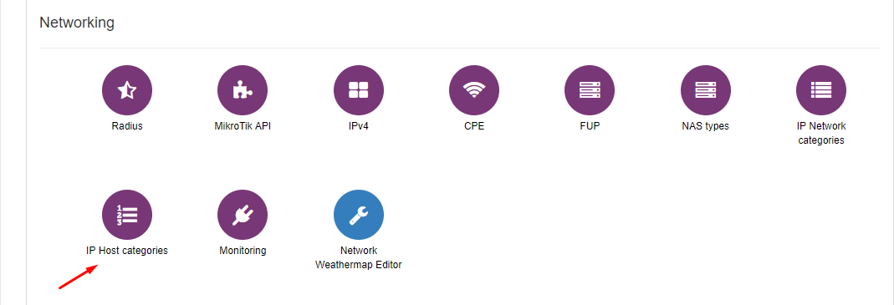
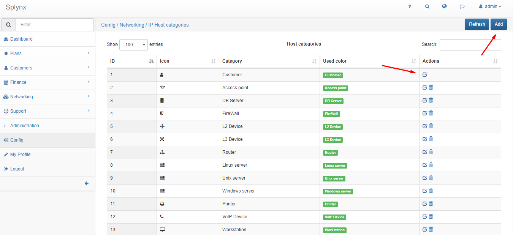
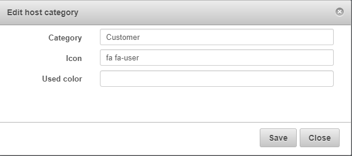
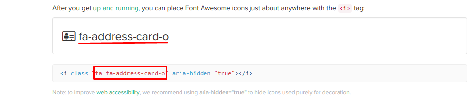

IP Host categories
=================

To configure IP Host categories click on `Config → Networking → IP Host categories`:

It is possible to add, edit or delete IP Host categories here:

When you edit existing IP Host category you can change the name of Category, Icon and used colour:

You can see available icons and its names on this [web](http://fontawesome.io/icons/).
Click on one:

And write in Icon field the red text between commas:

