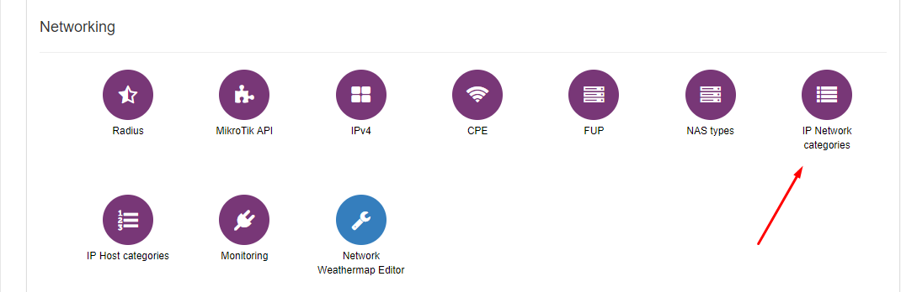
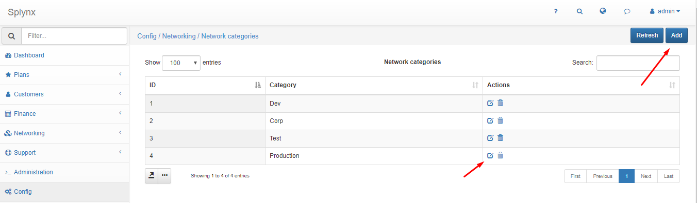
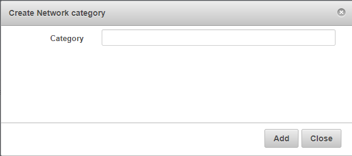

IP Network categories
=====================

You can edit or add new Network categories by clicking on `Config → Networking → IP Network Categories`.

Click on   to edit existing one or click on Add to create a Network category:

The window will pop-up where you can write the name of category.

