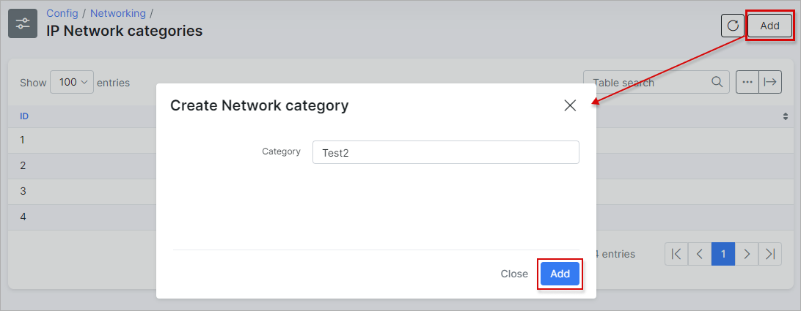

IP Network categories
=====================

You can edit or add new Network categories by navigating to `Config → Networking → IP Network Categories`.

IP network categories can be added/removed or edited here.

To add a new category click on the "Add" button, at the top right of the page:

