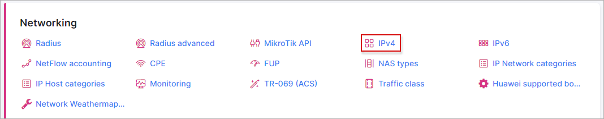
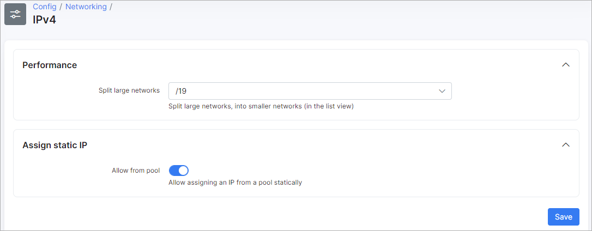

IPv4
====

To configure  features of IPv4, navigate to `Config → Networking → IPv4`:

There are two options available here:

* **Performance** - If you need to work with big networks, this option divides it into smaller networks (for a list).
* **Assign static IP** -  enable this option to allow assigning IP's from pools as static Ip's.
