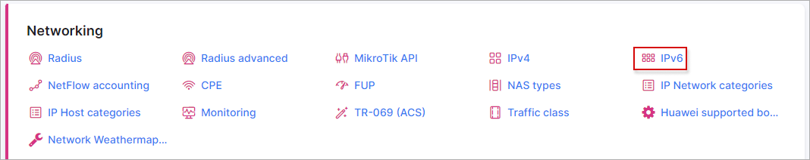
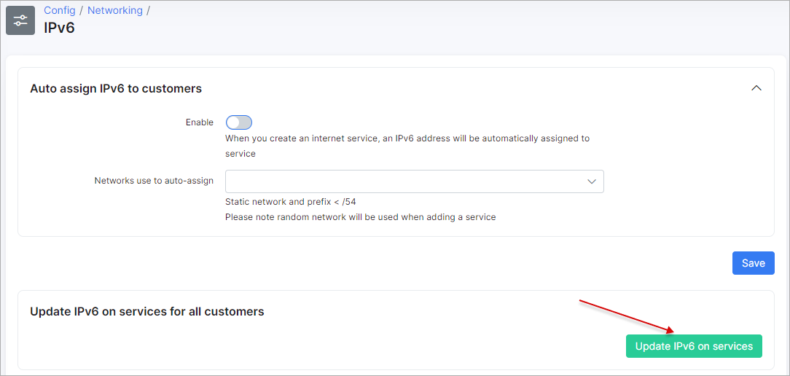

IPv6
====

To configure features of IPv6 navigate to `Config → Networking → IPv6`:

You will be presented with two options:

* **Auto assign IPv6 to customers**
  * **Enable** - enables/disables auto assigning of IPv6 addresses after creating a service;
  * **Networks use to auto assignee** - select the IPv6 networks to use for auto assignments.

* **Update IPv6 on services for all customers** -  click on this button to update IPv6 addresses for internet services.
