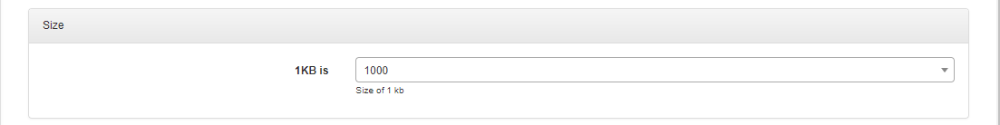
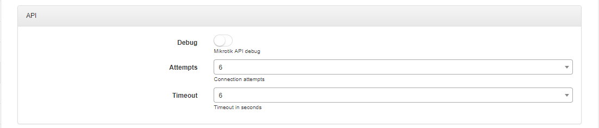
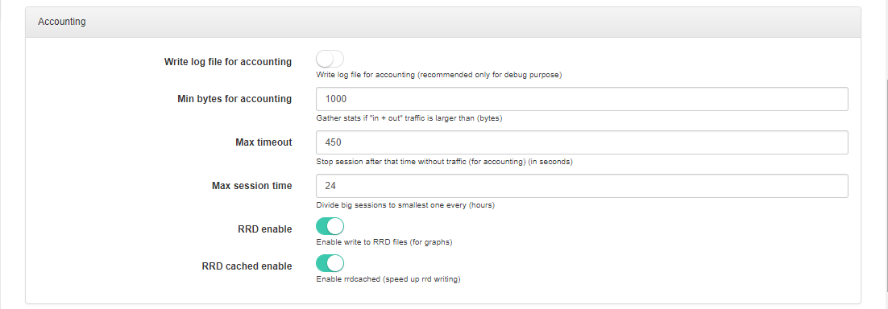
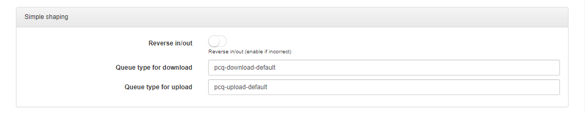

MikroTik API
===========

To configure MikroTik API click on `Config → Networking → MikroTik API`.

Choose if 1KB is 1000 or 1024 bytes**:

 Check if the Debug is enable or disable for MikroTik API, set number of attempts and Timeout in seconds:

#### Accounting:

  

* **Write log file for accounting** - Write log file for accounting (recommended only for debug purpose).
Min bytes for accounting - Gather stats if "in + out" traffic is larger than (bytes).
* **Max timeout** - Set timeout.
* **Max session time** - Divide big sessions to smallest one every (hours).
* **RRD enable** - Enable write to RRD files (for graphs).
* **RRD cached enable** - Enable rrdcached (speed up rrd writing).

#### Configure simple shaping:

* **Reverse In/Out** - Enable if you want to change upload by download and vice versa.
* **Queue type for download** - Set queue download type.
* **Queue type for upload** - Set queue upload type.

#### Configure PCQ shaping:

* **Shaping in** - Chain where the rules are created.
* **Shaping out** - Chain where the rules are created.
* **Routing in** - Set type of routing in.
* **Routing out** - Set type of routing out.
* **For radius** - If yes, rules will be made for all plans (but without address-list, and without aggregation in plans).
* **Connection mark** - Enable connection mark.
