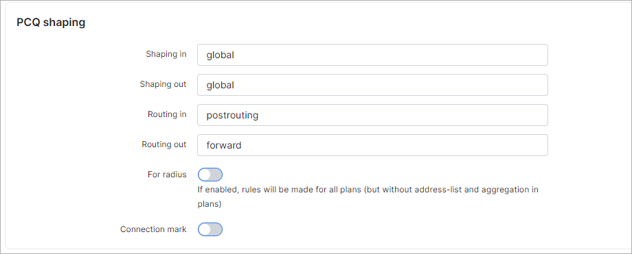
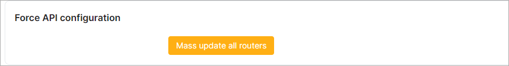

MikroTik API
===========

To configure MikroTik API navigate to `Config → Networking → MikroTik API`.

Configurations for the Mikrotik API can be found here.

### Size

Here we have to specify how many bytes is in 1KB in Splynx, available options are 1000 or 1024 bytes.

### API

* **Debug** - enables/disables API debug log (under /var/www/splynx/logs/cron/mikrotik.log). Recommended only for testing/debug purposes;

* **Attempts** - select connection attempts (1-10);

* **Timeout** - select timeout in seconds.

### Accounting

* **Write log file for accounting** - enables/disables accounting log (under /var/www/splynx/logs/cron/accounting.log). Recommended only for testing/debug purposes;

* **Min bytes for accounting** - gather stats if "in + out" traffic is larger than (bytes);

* **Max timeout** - stops the accounting session after this time if no traffic is recorded during the specified period of time (in seconds);

* **Max session time** - divides large sessions into smaller sessions every (hours);

* **RRD enable** - enables/disables writing to RRD files (for graphs);

* **RRD cached enable** - enables/disables RRD cache (speeds up RRD writing).

### Router accounting options

* **Account local traffic** - enables/disables accounting of the traffic to/from the router itself;

* **Threshold** - maximum number of IP pairs in the accounting table (allowed value is 1024-256000).

### Simple shaping

* **Reverse in/out** - enable this if you want to change upload by download and vice versa;
* **Queue type for download** - set the queue download type;
* **Queue type for upload** - set the queue upload type.

### PCQ shaping

* **Shaping in** - chain where the rules are created;
* **Shaping out** - chain where the rules are created;
* **Routing in** - set the type of routing in;
* **Routing out** - set the type of routing out;
* **For radius** - if yes, rules will be created for all plans (but without address-list, and without aggregation in plans);
* **Connection mark** - enables a connection mark.

### PPP secrets

* **Add caller ID** - enables/disables adding the MAC address to the restriction (PPP) via API;

### IP firewall filter/DHCP

* **Add framed route** - enables/disables adding routes to the service's additional network field if IP-MAC filter or DHCP is enabled;

* **Include inactive customers** - enable this toggle to include inactive customers when adding 'Disabled customers to address list'; 

* **Filter rules** - list of rules that will be uploaded to the router. Use {{SPLYNX_ALLOWED_RESOURCES_ADDRESS_LIST}} for allowed resources' address list name and {{SPLYNX_IP_ADDRESS}} for Splynx IP address.

<icon class="image-icon"></icon> **IMPORTANT:** Only **IP/IPv6 firewall filter rules without comments** are allowed, firewall address list entries are not supported in this field.

* **Filter rules position** - select the position for firewall filter rules. Available options are: keeps current, top, bottom;

* **Splynx IP address** - set the Splynx server IP address if you want customers to be redirected to blocking pages;

* **Allowed resources address list name** - name for the address list for allowed resources;

* **Allowed resources addresses** - allowed resources addresses (IP or URL).

### Force API configuration

Click on `Mass update all routers` if you want to apply new Mikrotik API configurations.
