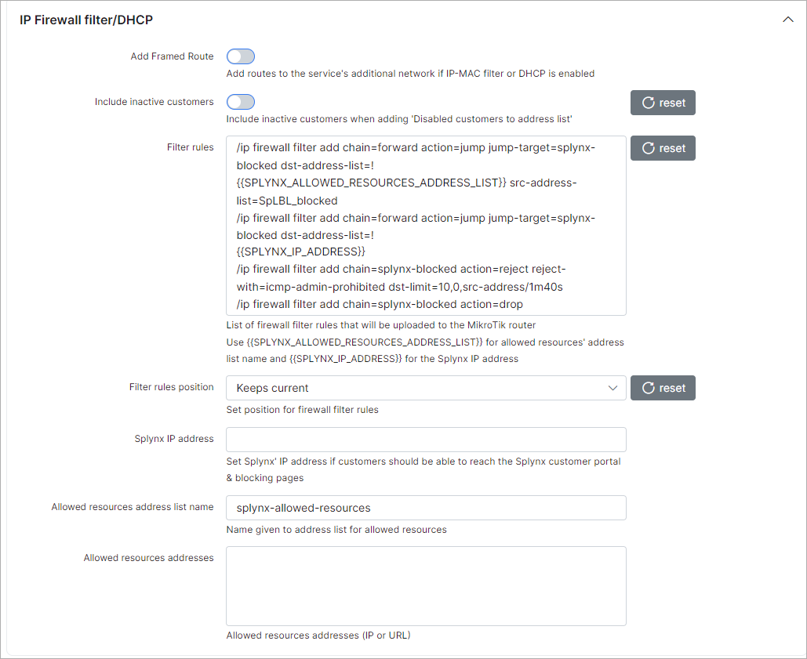

MikroTik API
===========

To configure MikroTik API navigate to `Config → Networking → MikroTik API`.

Configurations for the Mikrotik API can be found here.

### Size

Here we have to specify how many bytes is in 1KB in Splynx, available options are 1000 or 1024 bytes.

### API

* **Debug** - enables/disables API debug log(under /var/www/splynx/logs/cron/mikrotik.log). Recommended only for testing/debug purposes;

* **Attempts** - select connection attempts(1-10);

* **Timeout** - select timeout in seconds.

#### Accounting

* **Write log file for accounting** - enables/disables accounting log(under /var/www/splynx/logs/cron/accounting.log). Recommended only for testing/debug purposes;

* **Min bytes for accounting** - Gather stats if "in + out" traffic is larger than (bytes);

* **Max timeout** - stops the accounting session after this time if no traffic is recorded during the specified period of time(in seconds);

* **Max session time** - Divides large sessions into smaller sessions every (hours);

* **RRD enable** - enables/disables writing to RRD files(for graphs);

* **RRD cached enable** - enables/disables rrd cache (speeds up rrd writing).

### Router accounting options

* **Account local traffic** - enables/disables accounting of the traffic to/from the router itself;

* **Threshold** - maximum number of IP pairs in the accounting table(allowed value is 1024-256000).

### Simple shaping

* **Reverse In/Out** - Enable this if you want to change upload by download and vice versa;
* **Queue type for download** - Set the queue download type;
* **Queue type for upload** - Set the queue upload type.

### PCQ shaping:

* **Shaping in** - Chain where the rules are created;
* **Shaping out** - Chain where the rules are created;
* **Routing in** - Set the type of routing in;
* **Routing out** - Set the type of routing out;
* **For radius** - If yes, rules will be created for all plans (but without address-list, and without aggregation in plans);
* **Connection mark** - Enables a connection mark.

### PPP secrets

* **Add caller ID** - enables/disables adding the MAC address to the restriction (PPP) via API;

* **Include inactive customers** - enables/disables including inactive customers when adding "Disabled customers to address list" under the router in Splynx on the "Mikrotik" tab.

### IP firewall filter/DHCP

* **Add framed route** - enables/disables adding routes to the service's additional network field if IP-MAC filter or DHCP is enabled;

* **Filter rules** - list of rules that will be uploaded to the router. Use {{SPLYNX_WHITE_RESOURCES_ADDRESS_LIST}} for white resources Address list name and {{SPLYNX_IP_ADDRESS}} for Splynx IP address;

* **Filter rules position** - select the position for firewall filter rules. Available options are: default, top, bottom;

* **Splynx IP address** - set the Splynx server IP address if you want customers to be able to redirect to blocking pages;

* **White resources Address list name** - name for the address list for white resources;

* **White resources addresses** - white resources addresses(IP or URL).

### Force API configuration

Click on "Push config to all routers" if you want to apply new Mikrotik API configurations.
