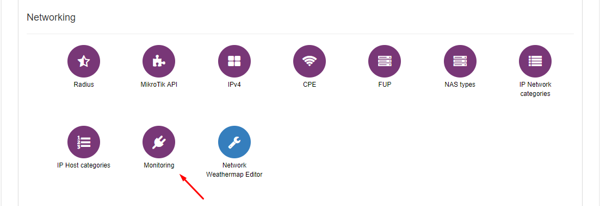
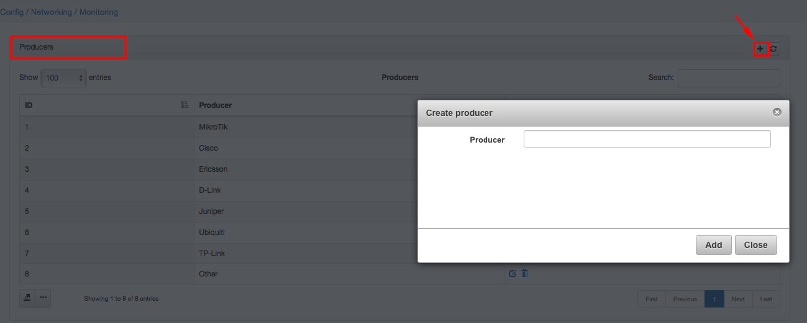
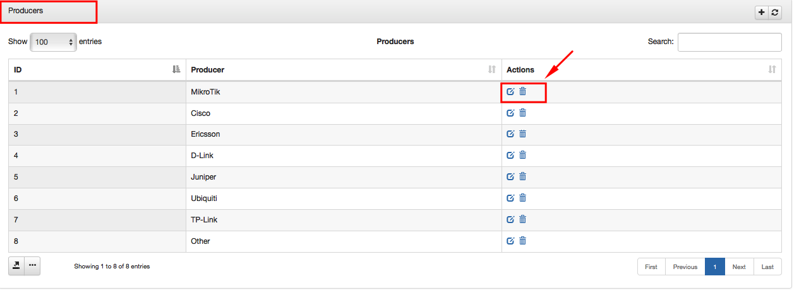
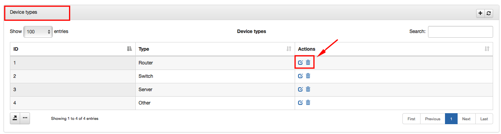

Monitoring config
=================

To configure Monitoring click on `Config → Networking → Monitoring`.

There you can:
1. Add new Producers by adding their names.

  

  You can also edit or delete Producer here by clicking on icons  and :

  

2. Add new Device types:

  

  You can also edit or delete them here by clicking on icons  and :

  

3. Create Groups for custom notifications:

  

  

  * **Group** - Set name of group.
  * **Administrators for notifications** - Choose administrators who will recieve notificaitons.
  * **Notifications to Splynx** - Enable Splynx notifications.
  * **Notifications to email** - Enable email notifications.
  * **Notifications via sms** - Enable sms notifications.
