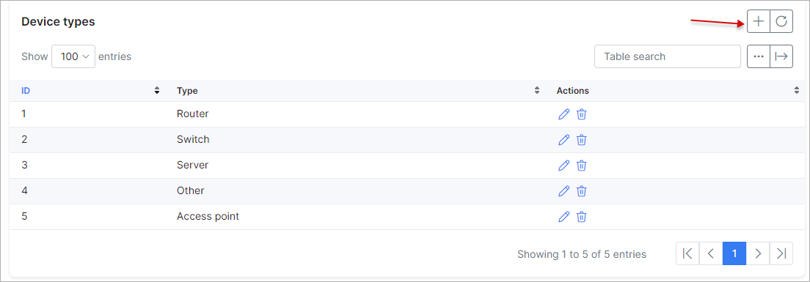

Monitoring configuration
=================

To configure Monitoring navigate to `Config → Networking → Monitoring`.

### Vendors

Here, you will be presented with a list of vendors. You can add/edit or remove vendors using the provided buttons, to add a new vendor click on the "+" button at the right top corner of the table.

### Device types

Here, you will be presented with a list of device types. To add a new device type click on the "+" button.

### Groups

Here, you will be presented with a list of groups for monitoring notifications. To edit existing groups, click on the edit button and to add a new group, click on the "+" button:

Let's add a new group called "Tech", with the following parameters:

**Parameter descriptions**:

* **Delay time for notification** - If the device does not change it's status during this delay (in minutes), a notification will be sent;

* **Administrators for notifications** - select the administrators for this group, who will receive notifications;

* **Notifications to Splynx** - enables/disables notifications on the Splynx admin web page when an admin is online;

* **Notification to email** - send notifications via email;

* **Notification email template** - select the template of email notification;

* **Notification via SMS** - send SMS notifications;

* **Notification SMS template** - select the template of SMS notification;

### Monitoring backups

Select an SSH timeout for monitoring backups.
