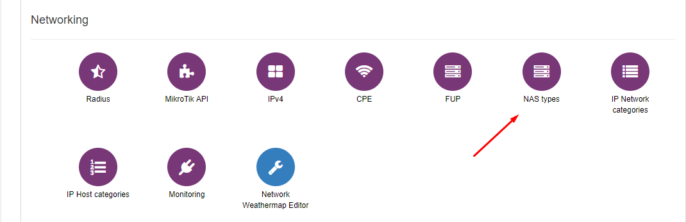
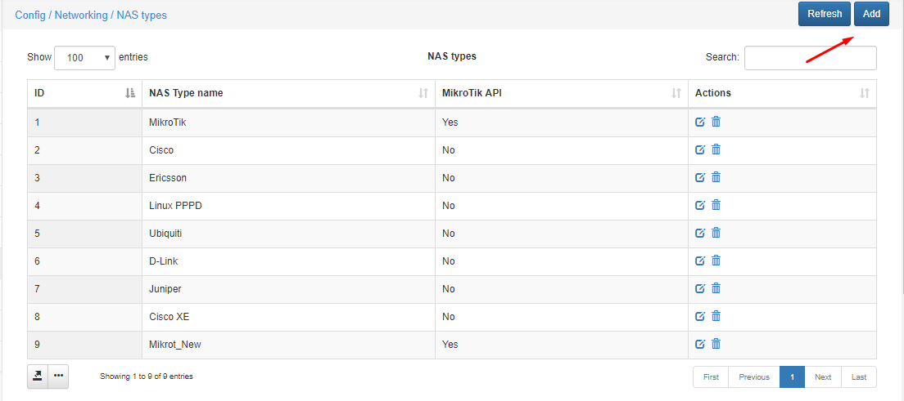
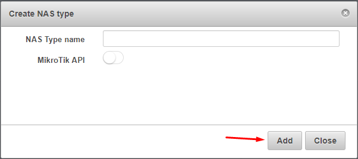

NAS types
=========

To configure NAS types click on `Config → Networking → NAS types`.

It is possible here to edit default ones or create new.

You can write the name of new NAS type and enable MikroTik API.

