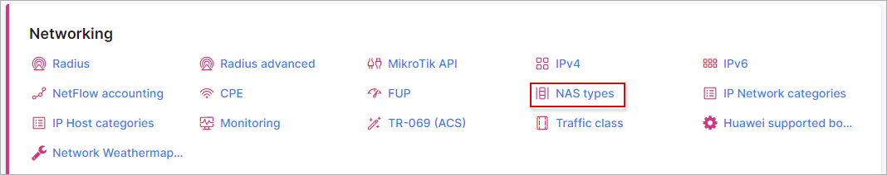
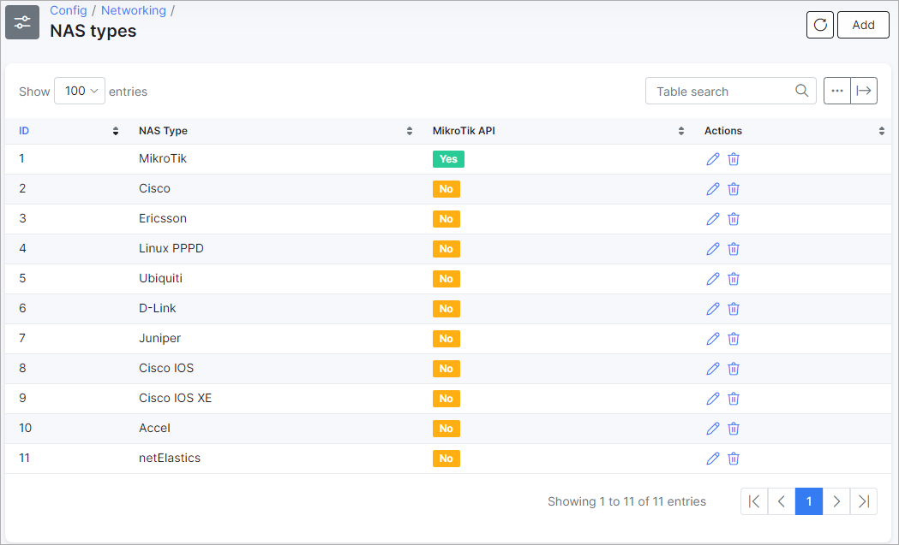
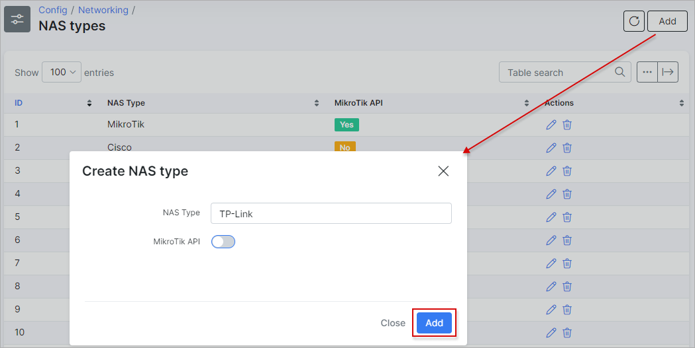

NAS types
=========

To configure NAS types navigate to `Config → Networking → NAS types`.

NAS types can be edited/added or removed here.

Click on the "Add" button to add a new NAS type:

If this NAS type can use Mikrotik API - enable this option.
