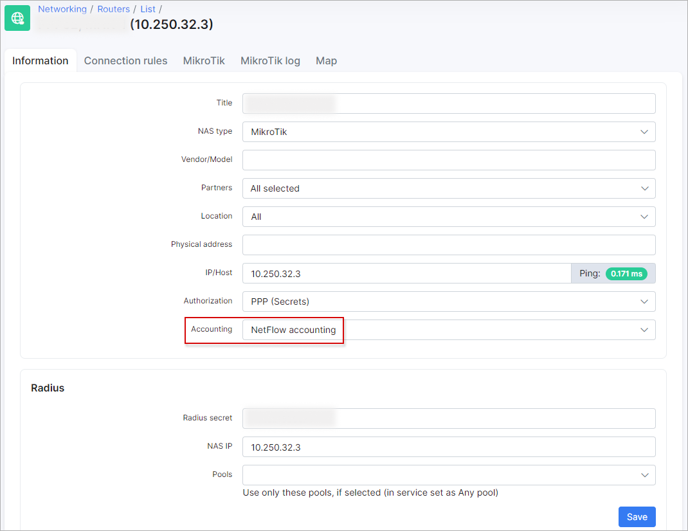
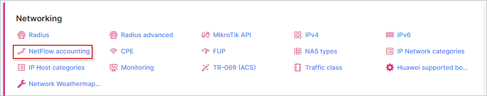
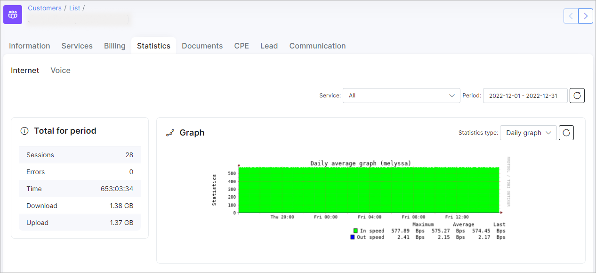

Mikrotik Traffic Flow Configuration
===========

Splynx supports *NetFlow* protocol and calculates statistic information about packets which pass through the Mikrotik router. In this article will be show how to configure your router and Splynx as a collector to receive a statistics for calculation.

Since Traffic Flow is fully compatible with *Cisco Netflow*, it can be used by various utilities that are designed for Netflow e.g. *ntop*, *flow-tools*, *ManageEngine NetFlow Analyzer* etc.

### Mikrotik configuration

The first thing to do is to enable *Traffic Flow* on the MikroTik and choose what router interface (-s) to monitor, all of these actions can done from the command line or from the GUI.

To configure **through the GUI** - open [Winbox](https://mt.lv/winbox64) and connect to the router (use [Wine](https://wiki.winehq.org/Ubuntu) to run Winbox on Ubuntu), the settings can be found in the menu `IP → Traffic Flow` on MikroTik:


In *Traffic Flow Settings* window, put the check mark near the option `Enabled`, set the interface to where your customer traffic is located.


The other options that are configurable here:

|   |   |
| ------------ | ------------ |
| **Interfaces:**   | All interfaces from which you want to collect NetFlow data. By default it is set to all​  |
| **Cache-entries:**  | Number of flows that the router can store in memory at once. Default is 4k  |
|  **Active-Flow-Timeout:** |  Maximum timeout of a flow. Default is 30minutes |
|  **Inactive-Flow-Timeout:**  | Period in seconds in which the flow is active. If the connection doesn't receive a packet in that time period, traffic-flow will send packet as a new flow. Default is 15 seconds​  |

Apply those changes and click on **Targets** button.
Then, press <icon class="image-icon"></icon> sign, in new *Traffic Flow Target* window and set the Splynx (collector) server details. Change the port from 2055 to `9995`, set `Version 5`. Click *Apply* and *OK*.

The other options that are configurable in the window:

|   |   |
| ------------ | ------------ |
| **​Src-address:**  | ​Source address which you will see in NetFlow collector as your exporter IP  |
| **Dst-address:**  |  NetFlow collector IP address (Splynx server IP) |
| **​Port:**  | NetFlow collector port on which it is listening. Usually it is 2055, but Splynx uses 9995  |
| **Version:**  |  NetFlow packet version |
| **V9-template-refresh:**  | Number of packets after which template is sent. Only for NetFlow v9 default is 20 |
| **V9-template-timeout:**  | If template has not been sent, send it after this value. Default is 1800  |

Traffic-Flow supports the following NetFlow **versions:**:

- `version 1` - the first version of NetFlow data format, do not use it, unless you have to;
- `version 5` - in addition to version 1, version 5 has possibility to include BGP AS and flow sequence number information. Currently RouterOS does not include BGP AS numbers;
- `version 9` - a new format which can be extended with new fields and record types thank's to its template-style design.

Under `IP → Traffic Flow`, click on **Status** tab, it should show the *Finished* and *Active* flows as seen below:


Now the router starts to send packets with Traffic-Flow information.

**Through the CLI** on the router, the following commands can be used to send flow records to the Splynx (collector).

**Enable Traffic Flow on the Mikrotik router:**
```
ip traffic-flow set enabled=yes cache-entries=4k set active-flow-timeout=30m inactive-flow-timeout=15s interfaces=all
```
**Specify the IP address and UDP port of the Splynx that will receive the Traffic-Flow packets:**

```
ip traffic-flow target add address=192.168.88.100.182:9995 disabled=no version=5
```

<details>
<summary><b>command for **version: 9**</b></summary>
<p markdown="1">

```
ip traffic-flow target add address=192.168.88.100.182:9995 disabled=no version=9 v9-template-refresh=20 v9-template-timeout=30m

```

</p>
</details>

**To view your settings:**

```
ip traffic-flow print
```

```
ip traffic-flow target print
```

### Splynx configuration

To add your router to Splynx, open `Networking → Routers → Add`, in new window, specify your router options, select **NetFlow accounting** as seen below:



More information about **Routers settings** you can find in this [article](networking/routers_settings/routers_settings.md).

In `Config → Networking → NetFlow accounting` we can change its *Daemon* and *Expire* options:




|   |   |
| ------------ | ------------ |
| **Daemon options:**  |   |
|  Interval|  Specifies the time interval in seconds to rotate files. The default value is 300 seconds |
| Port |  Specifies the port number to listen. Default port is 9995 |
|  **Expire options:** |   |
|  Directory size | Set size limit for the directory. The specified limit accepts values such as 100M, 100MB, 1G, 1.5G etc. Accpeted size factors are K, KB, M, MB, G, GB and T, TB  |
| Maxlife time  | Sets the max life time for files in the directory. The supplied maxlife_time accepts values such as 31d, 240H 1.5d etc. Accpeted time scales are w (weeks) d (days) H (hours)  |


With these configurations set, you should see traffic flowing on Splynx, e.g. open the customer's statistic to double check:



### Troubleshooting

Splynx uses some scripts from `nfdump` package to calculate traffic. The daemon `nfcapd` listens the port and the data can be received there.

When the interval for data collection ends, the data will be written to a file. After that the console script `./var/www/splynx/system/scripts/accounting-neflow` is started, it runs `nfdump` process with the specific parameters, script gets a response and converts it in the acceptable format for *Splynx Accounting Proccesor*.

To check if the `nfcapd` daemon is running:

```
ps -aux | grep nfcapd
```

To check log:

```
sudo tail -f /var/log/syslog | grep nfcapd
```
