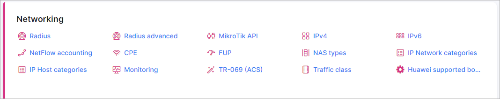

Network configuration
=====================

In the network configuration section, the following categories are available for configuring:

* [ CPE](configuration/network/cpe/cpe.md)

* [ FUP](configuration/network/fup/fup.md)

* [ IP host categories](configuration/network/ip_host_categories/ip_host_categories.md)

* [ IP network categories](configuration/network/ip_network_categories/ip_network_categories.md)

* [ IPv4](configuration/network/ipv4/ipv4.md)

* [ IPv6](configuration/network/ipv6/ipv6.md)

* [ Mikrotik API](configuration/network/mikrotik_api/mikrotik_api.md)

* [ Monitoring config](configuration/network/monitoring_config/monitoring_config.md)

* [ NAS types](configuration/network/nas_types/nas_types.md)

* [ Network weathermap editor](configuration/network/network_weathermap_editor/network_weathermap_editor.md)

* [ Radius](configuration/network/radius/radius.md)

* [Radius Extended](configuration/network/radius_extended/radius_extended.md)
