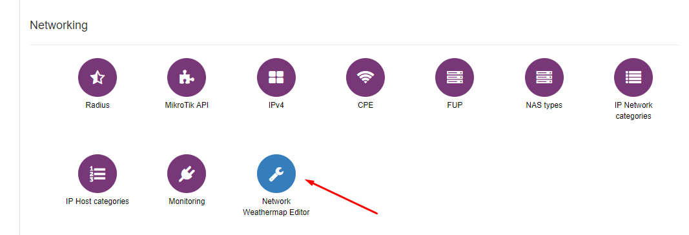
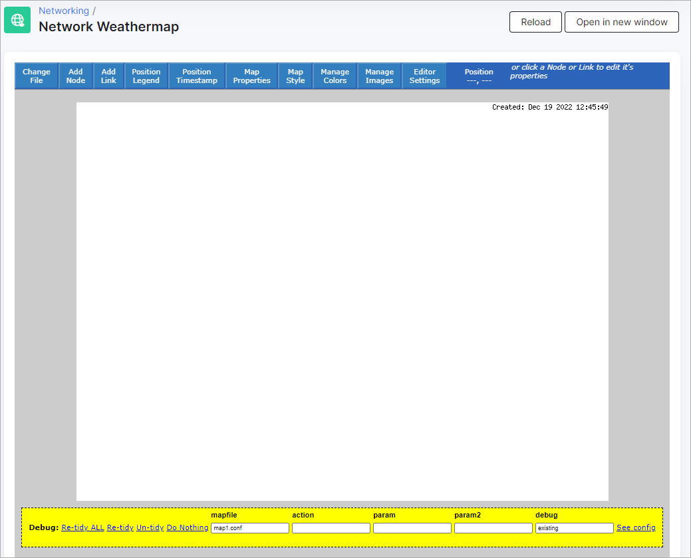
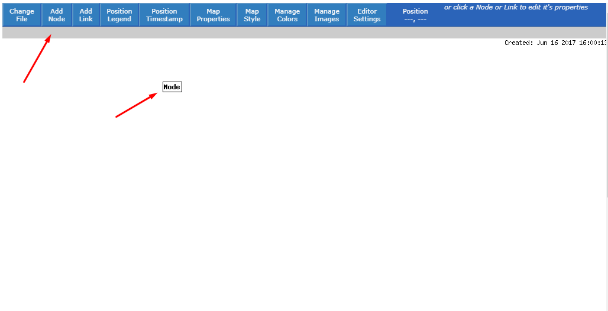
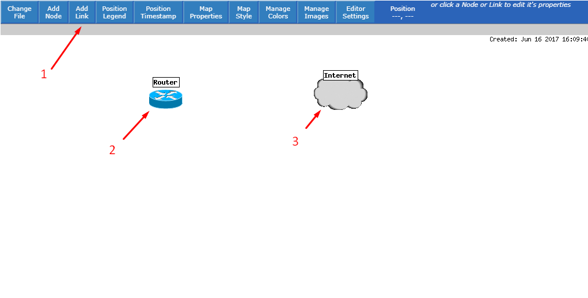
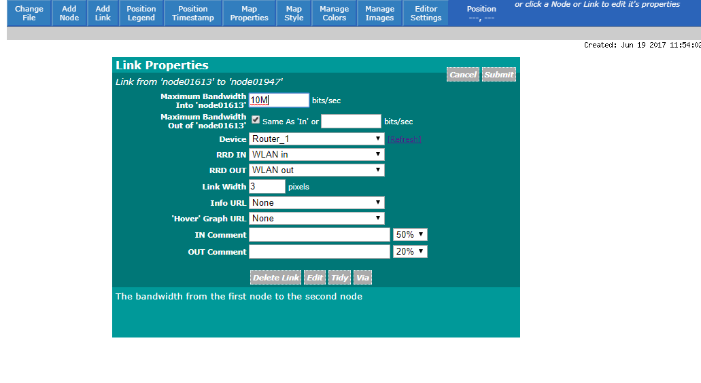
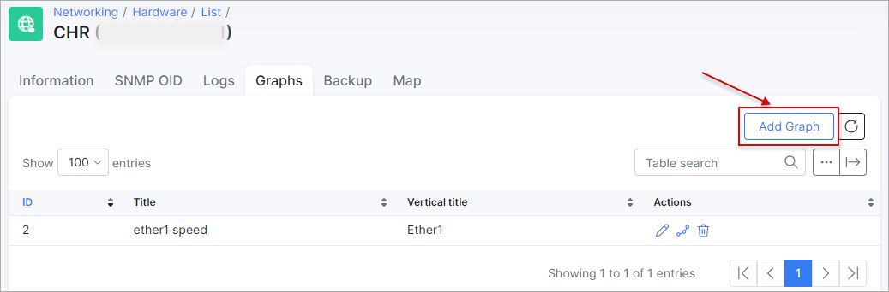
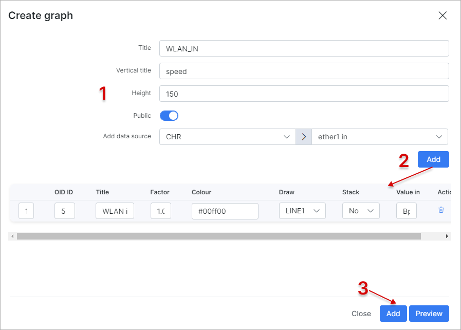
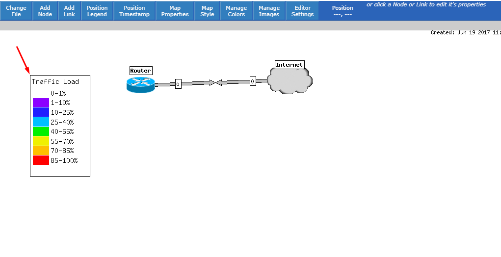
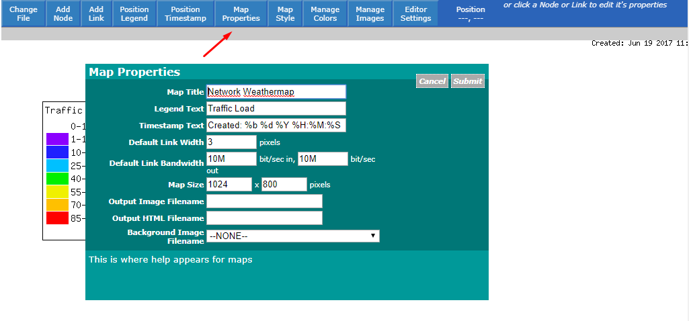
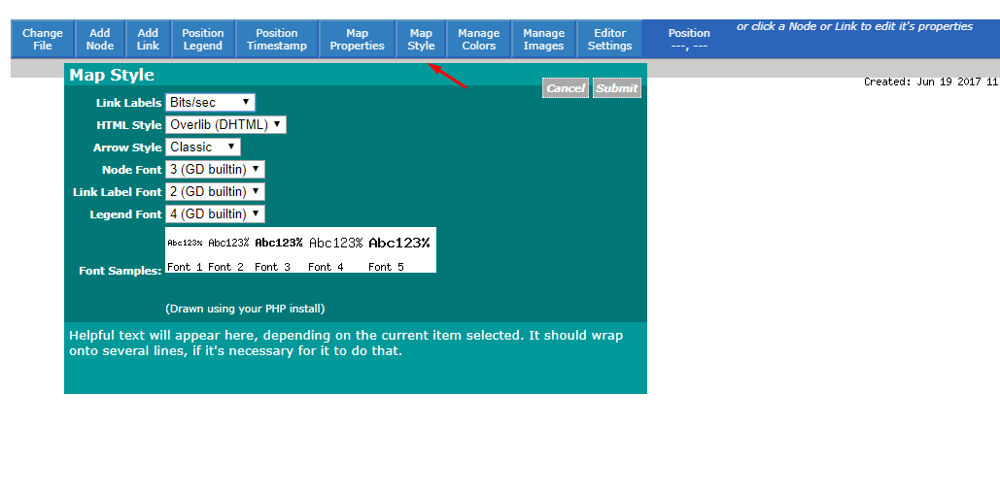

Network Weathermap Editor
=========================

To create a new map open the editor tool in Splynx under `Config → Networking → Network Weathermap`:

Define the name for the new MAP and create it. The new map "map1" was created and it is now empty:

You need to have a device(s) added to the system. Weathermaps work with equipment that has been added to `Networking → Monitoring`. Therefore, to generate a visualization of the network, we need to add devices to Monitoring and configure their SNMP OIDs for interface traffic, CPU's, etc. Once devices are added, we can create a node clicking on *Add Node*, and then place it somewhere on the map.

To configure node settings click on the node, you can set the position, label, which device it is, graphs and the icon.

Then we can add a link between two nodes by clicking on *Add Link*:

Click on the link to configure it:

 It is possible to add graphs of the link and view them by hovering the mouse on the link. To add graphs, navigate to `Networking → Monitoring → List` and select the device you want to add graphs for:

 

 Then, define the title, and select a router, and the parameter you want to visualize:

 

 You will be able to see the graphs under `Networking → Network Weathermap`, by hovering over the devices or links, as depicted in the image below:

To view the legend, click on Position Legend and then click somewhere on the map, the legend will appear where you've clicked.

It is also possible to edit the Map Properties and Style, where we can change a few settings of the Map:

