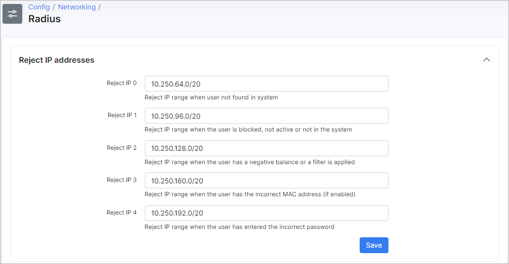

Radius
======

To configure the Radius Server click on `Config → Networking → Radius`.

#### These are Rejected IP addresses which ranges you can modify:

* **Reject IP 0** - Reject IP range when user not found (real).
* **Reject IP 1** - Reject IP range when user is blocked, not active or not in system.
* **Reject IP 2** - Reject IP range when user has negative balance or filter is applied.
* **Reject IP 3** - Reject IP range when user has wrong MAC address (if enabled) or other error.
* **Reject IP 4** - Reject IP range when user has entered wrong password.

Select the NAS type you are going to use and click on Load. You can use one by default or create a new NAS type. Information about NAS type creation is available [here](configuration/network/nas_types/nas_types.md)

A new configuration box will appear:

* **Allow no deposit** - Allow ballance with minus.
* **Allow without IP/MAC** - If disabled, IP/MAC will be checked during authorization. If enabled, authorization will be allowed with any IP/MAC.
* **Inverse rate limit** - Change rate limit of upload by upload and vice versa.
* **Inverse accounting** -
* **Accounting interval** (in sec) - Set time to update accounting.
* **Customer attributes field** -
* **Plan attributes field** -
* **Rate-Limit attributes** -
* **Customer Block** - Set blocking type.
* **CoA Block attributes** -
* **CoA Restore attributes** -
* **Cards Rate-Limit attributes** -
* **Radius incoming port** - Set port for incoming.
* **FUP CoA Rate-Limit attributes** -
* **FUP Block** - Set FUP blocking type.
* **FUP CoA Block attributes** -
* **FUP CoA Restore attributes** -
* **Use reject IP [0-4]** - Enable to use the IP's 0-4 explained in first step.
* **Reject [0-4] Attribute** -
* **Error session time limit** - limitation of the session time (in seconds) in case of an authorization error, forcing users to reconnect after a time out (for customers that do not have any active services).
This is necessary in order that after activation, the customer received his address from splynx, without manual reconnection on his part.

* **Use admin login** - Enable, allows to log on router with administrator credentials
* **Attribute for Read Group** -
* **Attribute for Write Group** -
* **Attribute for Full Group** -

There are two buttons at the bottom to Restart radius and Clear all online sessions.

