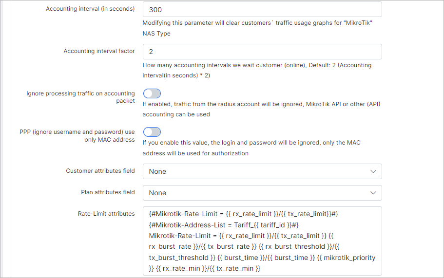

Radius
======

To configure the Radius navigate to `Config → Networking → Radius`.

#### These are Rejected IP addresses of which you can modify the ranges:

* **Reject IP 0** - Reject IP range when a user is not found (real);
* **Reject IP 1** - Reject IP range when a user is blocked, not active or not in system;
* **Reject IP 2** - Reject IP range when a user has a negative balance or a filter is applied;
* **Reject IP 3** - Reject IP range when a user has the wrong MAC address (if enabled) or other error;
* **Reject IP 4** - Reject IP range when a user has entered the wrong password.

Select the NAS type you are going to use and click on the **Load** button. You can use a default type or create a new NAS type. More information about NAS type creation is available [here](configuration/network/nas_types/nas_types.md)

### Mikrotik configuration

A new configuration section will appear:

* **Prevent duplicate session** - If a customer is online and tries to connect, send a disconnect package to the online session;
* **Allow with no account balance** - allows a connection when the account balance of the customer trying to connect is less than the specified  minimal balance;
* **Allow without IP/MAC** - if disabled, IP/MAC will be checked during authorization, and if enabled, authorization will be allowed with any IP/MAC;
* **MAC address field** - different NAS routers can use different fields of MAC addresses, default is "Calling-Station-Id";
* **Inverse rate limit** - change rate limit of upload by download and vice versa;
* **Inverse accounting** - change accounting of upload by download and vice versa;
* **Process accounting without IP** - enables/disables processing of accounting without IP;
* **Accounting interval** (in sec) - set a time to update accounting. Recommended value is 300-500;
* **Accounting interval factor** - set how many accounting intervals the system should  wait to consider the customer online and begin accounting. Default = 2;
* **Ignore processing traffic on accounting packet** - if this option is enabled, traffic from radius accounting packets will be ignored, Mikrotik API or another API accounting can be used;
* **PPP (ignore username and password) use only MAC** - if enabled, login/password will be ignored, only MAC addresses will be used for authorization;
* **Customer attributes field** - specify the customer additional field which will be used to send RADIUS attributes. Used for RADIUS customization;
* **Plan attributes field** - specify the tariff additional field which will be used to send RADIUS attributes. Used for RADIUS customization;
* **Rate-Limit attributes** - list of rate-limit attributes. Recommended keep default;
* **Customer Block** - when a customer's status is going to be "blocked", "inactive" and customer is online;
* **CoA Block attributes** - list of CoA block attributes. Please keep default;
* **CoA Restore attributes** - list of CoA restore attributes. Please keep default;
* **Cards Rate-Limit attributes** - list of rate-limit attributes. Please keep default;
* **Radius incoming port** - Set port for incoming RADIUS;
* **FUP CoA Rate-Limit attributes** - list of FUP CoA rate-limit attributes. Please keep default;
* **FUP Block** - Set FUP blocking type;
* **FUP CoA Block attributes** - list of FUP CoA block attributes. Please keep default;
* **FUP CoA Restore attributes** - list of FUP CoA restore attributes. Please keep default;
* **Overwrite CoA IP** - all CoA requests will be sent to this IP. Leave blank to use NAS-IP-address;
* **Overwrite PoD IP** - all PoD requests will be sent to this IP. Leave blank to use NAS-IP-Address;
* **CoA & PoD send session ID** - send session ID with COA&POD requests;
* **Use reject IP [0-4]** - Enable this to use the IP's 0-4 explained in the first step.
* **Reject [0-4] Attribute** - list of attributes of reject pools;
* **Error session time limit** - limitation of the session time (in seconds) in case of an authorization error, forcing users to reconnect after a time out (for customers that do not have any active services).
This is necessary in order that after activation, the customer received his address from Splynx, without manual reconnection on their part;

* **Use admin login** - when enabled, it allows logins to the router with administrator credentials
* **Attribute for Read Group** - specify the attribute for read group;
* **Attribute for Write Group** - specify the attribute for write group;
* **Attribute for Full Group** - specify the attribute for full group;

There are two buttons at the bottom of the page to Restart radius and Clear all online sessions.

* **Restart RADIUS** - will restart radius. Customer's connections can be dropped;
* **Clear online sessions** - will clear current online sessions.
