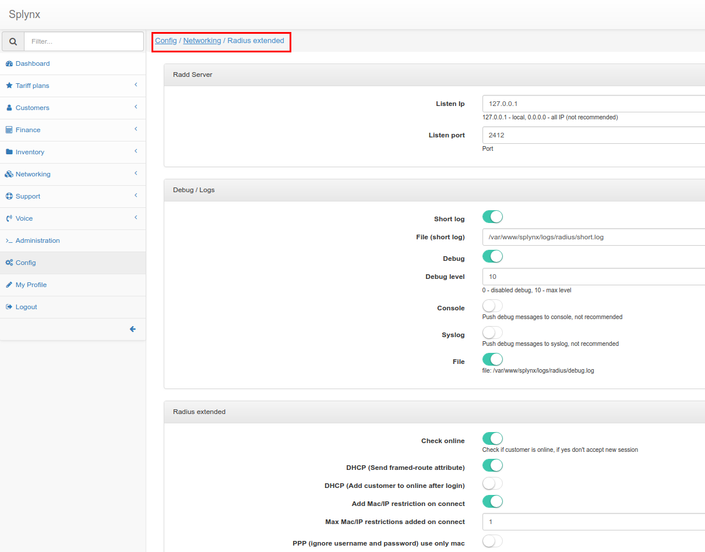

Radius Extended
===============

In addition to the main Radius configuration, here we can configure some extra features.

# Configuration

To change Radius Extended configuration, go to _Config / Networking / Radius extended_

## Radd Server

In Splynx we have two Radius servers. We use Freeradius as **external** Radius server; it accepts connections from clients (from routers). Freeradius transfers Radius requests to internal Radius server called **splynx_radd**. Here we can configure where **splynx_radd** listens connections.

**Listen Ip** - IP of **splynx_radd** server.  
**Listen port** - **splynx_radd** port.

 If you change configuration here, also you should change **PeerAddr**, **PeerPort** in _/etc/freeradius/splynx/splynx.pl_

## Debug / Logs

**Short log** - enable Radius short log.  
**File (short log)** - where Radius short log file is located.  
**Debug** - enable Radius debug log.  
**Debug level** - debug level (0..10). 10 - more verbose.  
**Console** - push debug messages to console, not recommended.  
**Syslog** - push debug messages to syslog, not recommended.  
**File** - push debug messages to file: /var/www/splynx/logs/radius/debug.log

## Radius extended

**Check online** - check if customer is already online. If online - do not allow new connection (with the same credentials). If **Check online** is disabled, customers can connect few times with the same credentials.  
**DHCP (Send framed-route attribute)** - Send framed-route from Radius server.  
**DHCP (Add customer to online after login)** - when we use DHCP, add customer to online after his/her connection immediately. If **DHCP (Add customer to online after login)** is disabled, customer will be added to online only when his/her traffic reaches accounting limit (under _Config / Networking / MikroTik API_)  
**Add Mac/IP restriction on connect** - If attribute MAC is empty in internet service settings - add MAC/IP from where customer connects.  
**Max Mac/IP restrictions added on connect** - maximum number of MAC/IP that can be added into internet service settings.  
**PPP (ignore username and password) use only mac** - Check only MAC address in internet service settings.  

## Administrators access

**Without NAS** - allow administrator access in case if NAS not found on Splynx  
**Default NAS id** - please put NAS ID, if you enable access without NAS

## Force network to use one NAS

**Force network to use one NAS** -  
**Network** - network (for example: 10.10.0.0/20).  
**Default NAS Id** - put NAS ID which will be used by default for all this network  
**Set static IP on connect** - If enabled, static IP will be set to service on connect

## Proxy accounting

Enable proxy accounting -  
**Radius host** - IP:Port  
**Radius secret** - Radius secret
**NAS type ID** - request for this NAS Type will be proxied to next radius, 0 - all

## IP From pools (assignment)

**Link locations** - Link customer **location** to IP Pool **location**, this will work on case if in customer service selected Any pool, and all locations will cover different pools.  
**Use poll with Location = All** - In case of pool with customer location not found, we can use Pools with Location = All.