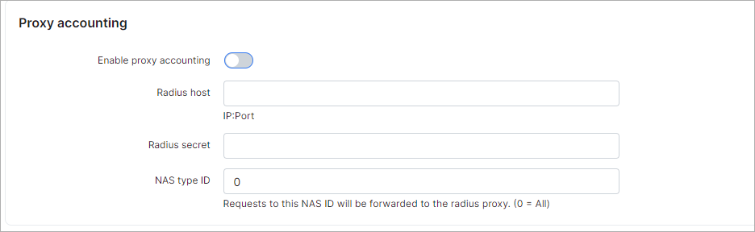

Radius Advanced
===============

In addition to the main Radius configuration, in this section, we can configure additional features of Radius.

To change Radius Advanced configurations, navigate to `Config → Networking → Radius advanced`.

## Radd Server

In Splynx we have two Radius servers. We use Freeradius as an **external** Radius server; it accepts connections from clients (from routers). Freeradius transfers Radius requests to the internal Radius server called **splynx_radd**. Here we can configure where **splynx_radd** listens to connections.

* **Listen Ip** - IP of the **splynx_radd** server.  
* **Listen port** - **splynx_radd** port.

<icon class="image-icon"></icon> If you change the configuration here, you should also change it in the **PeerAddr** and **PeerPort** configuration in the _/etc/freeradius/splynx/splynx.pl_ file.

## Debug / Logs

* **Short log** - enables/disables Radius short logs;  
* **File (short log)** - Radius short.log file location;  
* **Debug** - enables/disables Radius debug log (/var/www/splynx/logs/radius/debug.log);  
* **Debug level** - debug level (0 - 10), 10 - more detailed;  
* **Console** - push debug messages to console, not recommended;  
* **Syslog** - push debug messages to syslog, not recommended;
* **File** - push debug messages to file: /var/www/splynx/logs/radius/debug.log

## Radius extended

* **Check online** - checks if a customer is already online. If online, do not allow a new connection (with the same credentials). If disabled, customers can connect multiple times with the same credentials;

* **DHCP (Send framed-route attribute)** - send a framed-route from the Radius server;

* **DHCP (Add customer to online after login)** - when we use DHCP, add customers to the online list, immediately after they connect. If disabled, customers will be added to the online list, only when their traffic reaches the accounting limit (under *Config → Networking → MikroTik API* "Min bytes for accounting");

* **Bind MAC address on first connect** - if the  MAC attribute is empty in the internet service settings, this adds the MAC/IP from where the customer connects for the first time;  

* **Maximum unique MAC addresses** - maximum number of MAC addresses that can be added into the internet service settings;

* **Overwrite oldest mac in case of new trying to log-in** - enable this toggle to overwrite the previous MAC address when there is a new trying to log-in.

## Administrative access

* **Allow admins to access unknown NAS devices** - allows administrators access in case the NAS is not found on Splynx;
* **Default NAS ID** - NAS ID, needed if access without NAS is enabled.

## Radius NAS settings

* **Force the specified network to use one NAS** - enables/disables forcing a network to use only one NAS;

* **Network** - specify the network (for example: 10.10.0.0/20) if the previous settings is enabled;   

* **Default NAS ID** - NAS ID which will be used by default for the network from the previous setting;  

* **Set static IP on connect** - if enabled, static IPs will be set to services on connecting.

## Proxy accounting

* **Enable proxy accounting** - enables/disables proxy accounting;  
* **Radius host** - IP:Port;  
* **Radius secret** - Radius secret;
* **NAS type ID** - request for this NAS Type will be proxied to the next radius, 0 - all.

## IP From pools (assignment)

* **Link locations** - link the customer location to the IP pool location. This will work in a case where, in the customer service,  "Any pool" is selected, and all locations will cover different pools;

* **Use IP pool with "Location = All"** - in case if the pool associated with the customer location is not found, we can use Pools with Location = All.

## Periodic radius server restart

We can specify periodic restarts of the radius server to prevent memory leaks here. The use of this feature is highly recommended.

* **Enable** - enables/disables periodic restarts;

* **Restart once per** - select a period for the periodic restart (day, week, month);

* **Hour** - time when the radius server will be restarted. Recommended time: late at night, midnight or after.

## RADIUS tools

* **Restart radius** - the radius server can be restarted with this button. Recommended to use after new configurations have been made to apply the changes, after the reboot. **Be attentive - customers can be disconnected!**
