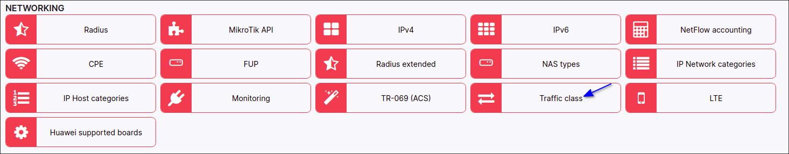
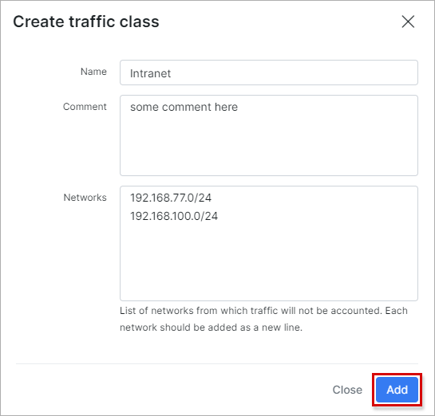
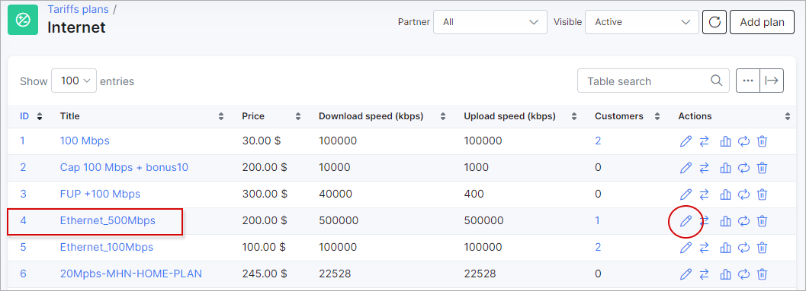
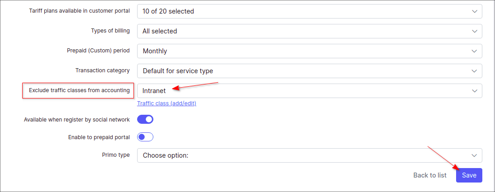

Traffic class
=====================

The goal of client's network optimization and tuning is to find the sources of unwanted network traffic and to take steps to correct or eliminate the root causes in order to enhance network performance and to avoid unnecessary traffic counting. **Traffic class** feature in Splynx is designed to help you to exclude the inbound and outbound traffic from counting.

For example, you can add the IP address of your local network with some resources in order to ignore its internal traffic for your customers in Splynx.

To **create a new traffic class** with the new network (-s), open `Config → Networking → Traffic class` and press `Add` button

In the new window, type your traffic class **name**, the related **comment** and specify the **network** address (-es) and its [mask](https://en.wikipedia.org/wiki/Subnetwork) from which traffic should not be counted. Please mind that each network address should be **added from the new line**, the adding of the **domain names are not supported**.

Then, press `Add` to save changes.

**NOTE:** **Traffic class** feature works only with [API](networking/authentication_of_customers/mikrotik_local_auth_api/mikrotik_local_auth_api.md) and [NetFlow](configuration/network/netflow_accounting/netflow_accounting.md) types of accounting and covers the inbound and outbound traffic. You can check what type of `accounting` is used on your router in `Networking → Routers → List`.

After that we should add the newly created traffic class to some of our **Internet tariff** plan, open `Tariff plans → Internet`, find the necessary plan, e.g. *Ethernet_500Mbps* and click on <icon class="image-icon"></icon> icon

In the new window, find the field `Exclude traffic classes from accounting` and select the name of the previously created traffic class from the drop-down list. After the `Save` button is pressed, the traffic in selected networks will begin to **be ignored immediately in those services that use this tariff**.

To check the traffic statistic, open a profile of some customer in `Customers → List` and click on [Statistic](customer_management/customer_statistics/customer_statistics.md) tab.
