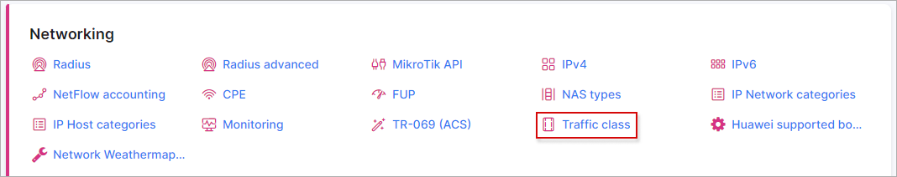
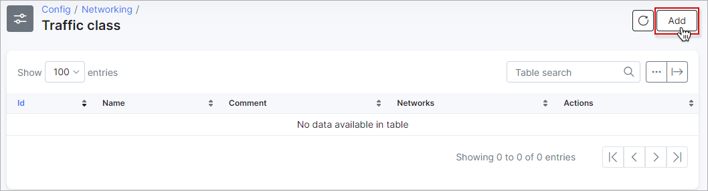
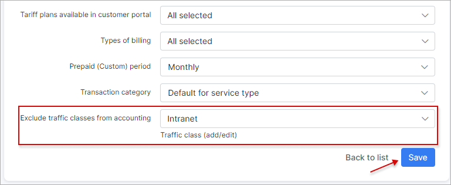
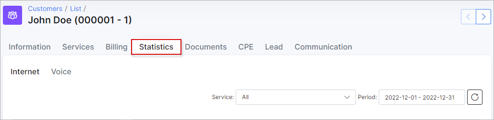

Traffic class
=====================

The goal of the client's network optimization and its tuning is to find sources of unwanted network traffic and to take steps to correct or eliminate the root causes in order to enhance the network performance and avoid unnecessary traffic accounting. **Traffic class** feature in Splynx is designed to help you to exclude the inbound and outbound traffic from accounting.

For example, you can add the IP address of your local network with some resources in order to ignore its internal traffic for your customers in Splynx.

To **create a new traffic class** with a new network(-s), open `Config → Networking → Traffic class` and click on the `Add` button:

In the new window, type your traffic class **name**, the related **comment** and specify the **network** address(-es) and its [mask](https://en.wikipedia.org/wiki/Subnetwork) from which traffic should not be counted. Please mind that each network address should be **added from the new line**, the adding of the **domain names are not supported**.

Then click on `Add` to save changes.

<icon class="image-icon"></icon> **Traffic class** feature works only with [API](networking/authentication_of_customers/mikrotik_local_auth_api/mikrotik_local_auth_api.md) and [NetFlow](configuration/network/netflow_accounting/netflow_accounting.md) types of accounting and covers the inbound and outbound traffic. You can check what type of `accounting` is used on your router in `Networking → Routers → List`.

After that, we should add the newly created traffic class to some of our **Internet tariff** plan, open `Tariff plans → Internet`, find the necessary plan, e.g. *Ethernet_500Mbps* and click on <icon class="image-icon"></icon> icon:

In the new window, find the field `Exclude traffic classes from accounting` and select the name of the previously created traffic class from the drop-down list. After the `Save` button is pressed, the traffic in selected networks will begin to **be ignored immediately in those services that use this tariff**.

To check the traffic statistics, open some customer's profile in `Customers → List` and click on [Statistics](customer_management/customer_statistics/customer_statistics.md) tab:

