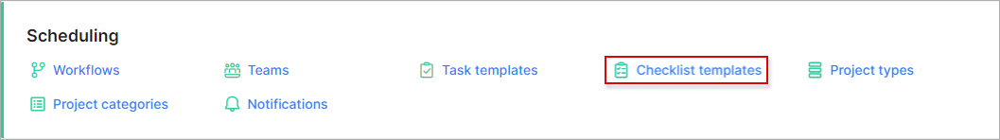
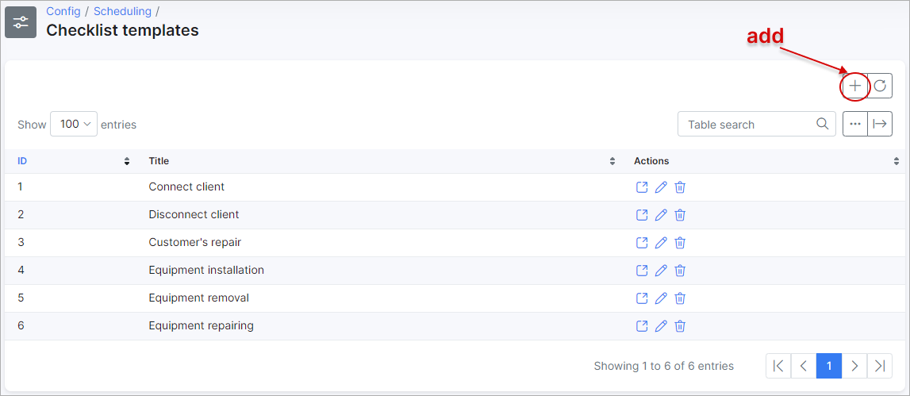
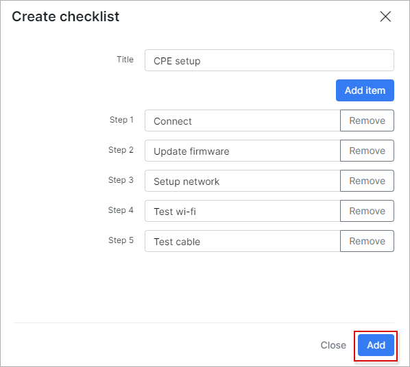
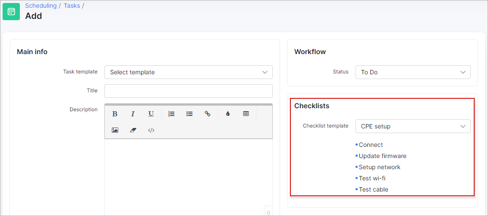

Checklist templates
=============
In this section we can add, edit or remove checklists that will be used in tasks.

**_Config -> Scheduling -> Checklist templates_**

Let's add a new checklist:

Select a title and add the relevant steps needed to complete the checklist.

Once the checklist has been created, it will be available to be used in tasks.

