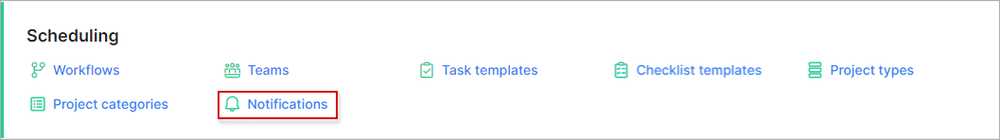
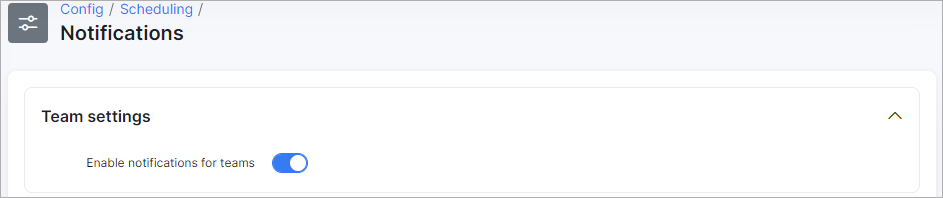
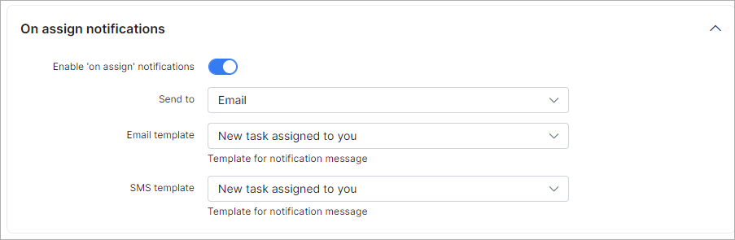
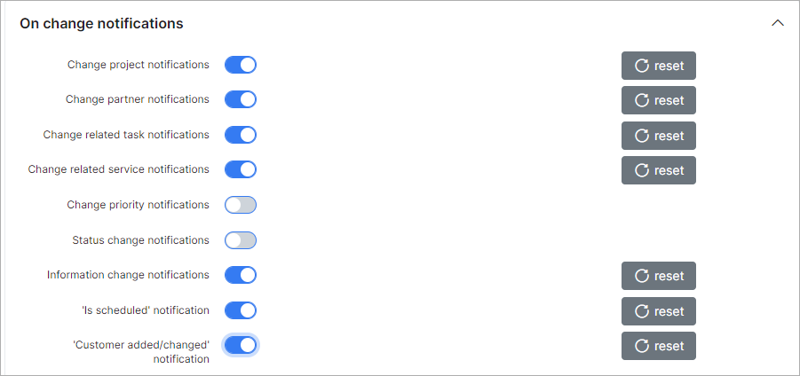
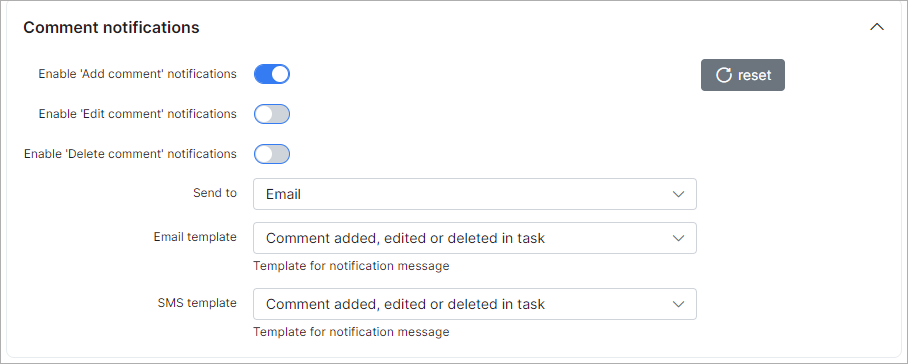
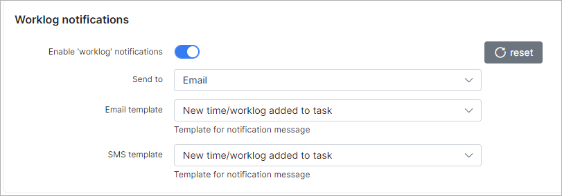
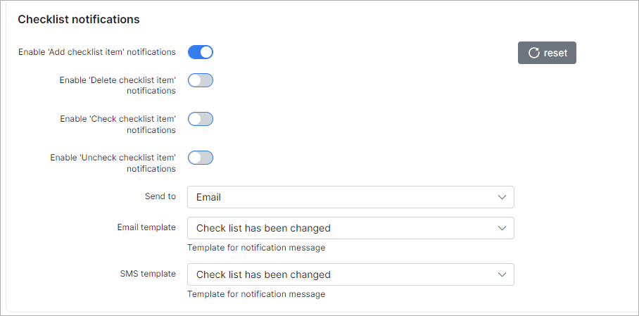
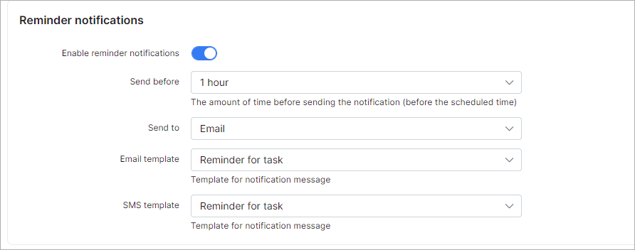
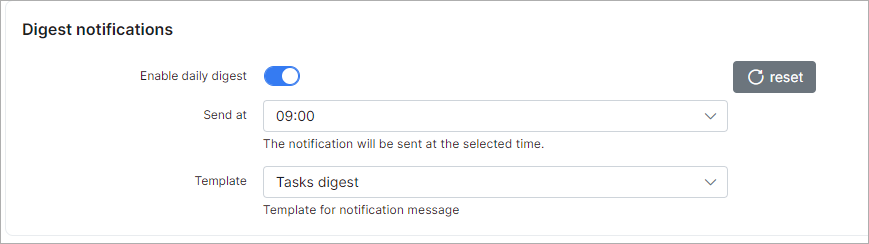
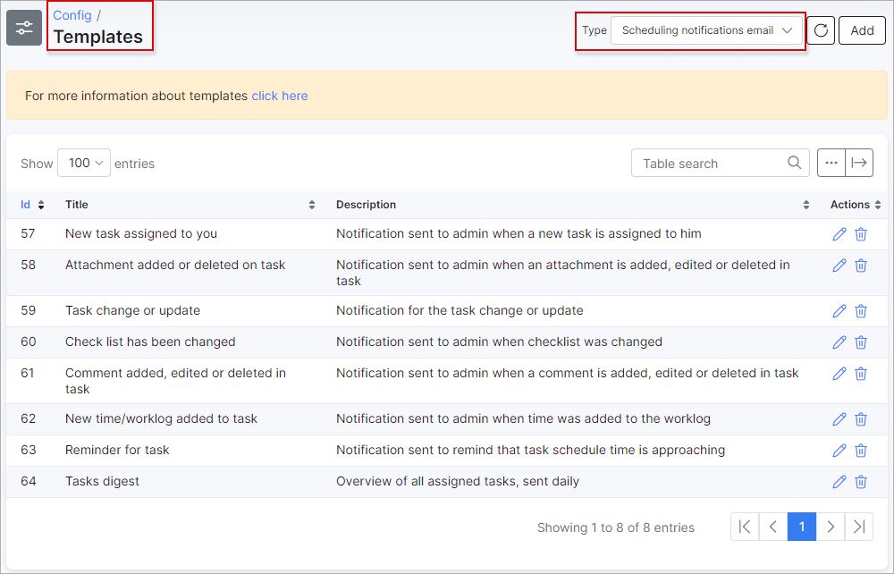

Notifications
=============
In this section, we can configure our scheduling notifications.

Navigate to **_Config -> Scheduling -> Notifications_**

## Team settings

* **Enable notifications for teams** - enables/disables teams notifications (if tasks are assigned to teams).

## On assign notifications

* **Enable "on assign" notifications** - enables/disables notifications when tasks are assigned/reassigned;

* **Send to** - select how notification will be sent, via email, SMS or email + SMS;

* **Subject** - type the subject of notification;

* **Email template** - select the template to use for the for email notification;

* **SMS template** - select the template to use for the SMS notification.

## On change notifications

* **Change project notifications** - enables/disables sending of notifications when a project has been changed;

* **Change partner notifications** - enables/disables sending of notifications when the project partner has been changed;

* **Change related task notifications** - enables/disables sending of notifications when related tasks has been changed changed;

* **Change related service notifications** - enables/disables sending of notifications when related service has been changed;

* **Change priority notifications** - enables/disables sending of notifications when the priority has been changed;

* **Status change notifications** - enables/disables sending of notifications when the status has been changed;

* **Information change notifications** - enables/disables sending of notifications when information has been changed;

* **"Is scheduled" notification** - enables/disables sending of notifications when a task is scheduled;

* **Customer added/changed notification** - enables/disables sending of notifications when customer changed/added a task;

* **Send to** - select how notifications will be sent, via email, SMS or email + SMS;

* **Subject** - type the subject of notification;

* **Email template** - select the template for the email notification;

* **SMS template** - select the template for the SMS notification.

## Comment notifications

* **Enable 'add attachment' notifications** - enables/disables sending of notifications when attachments are added;

* **Enable 'delete attachment' notifications** - enables/disables sending of notifications when an attachment is removed;

* **Send to** - select how notifications will be sent, via email, SMS or email + SMS;

* **Subject** - type the subject of notification;

* **Email template** - select the template for the email notification;

* **SMS template** - select the template for the SMS notification.

## Worklog notifications

* **Enable 'worklog' notifications** - enables/disables sending of worklog notifications;

* **Send to** - select how notification will be sent, via email, SMS or email + SMS;

* **Subject** - type the subject of notification;

* **Email template** - select the template for the email notification;

* **SMS template** - select the template for the SMS notification.

## Checklist notifications

* **Enable 'add checklist item' notifications** - enables/disables sending of notifications when an item is added to the checklist;

* **Enable 'delete checklist item' notifications** -  enables/disables sending of notifications when an item has been removed from the checklist;

* **Enable 'check checklist item' notifications** -  enables/disables sending of notifications when an item has been marked in the checklist;

* **Enable 'uncheck checklist item' notifications** -  enables/disables sending of notifications when an item has been unmarked in the checklist;

* **Send to** - select how notification will be sent, via email, SMS or email + SMS;

* **Subject** - type subject of notification;

* **Email template** - select the template for the email notification;

* **SMS template** - select the template for the SMS notification.

## Reminder notifications

* **Enable reminder notifications** -  enables/disables sending of reminder notifications;

* **Send before** - set the amount of time before sending the notifications (before scheduled time);

* **Send to** - select how notification will be sent, via email, SMS or email + SMS;

* **Subject** - type the subject of notification;

* **Email template** - select the template for the email notification;

* **SMS template** - select the template for the SMS notification.

## Digest notifications

* **Enable daily digest** -  enables/disables sending of daily notifications about tasks;

* **Send at time** - set what time to send notifications;

* **Subject** - type the subject of the notification;

* **Template** - select the template for the notification.

### All templates can be found under [Config - Templates](configuration/system/templates/templates.md)

Navigate to **Config / System / Templates**:

Email templates for scheduling:

SMS templates for scheduling:

