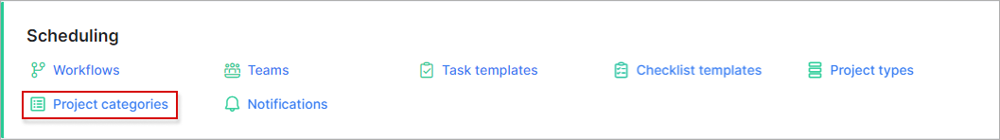
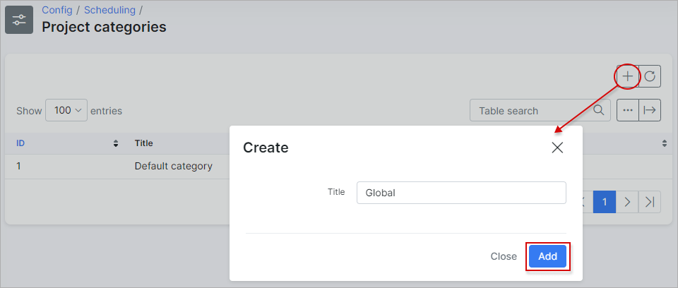
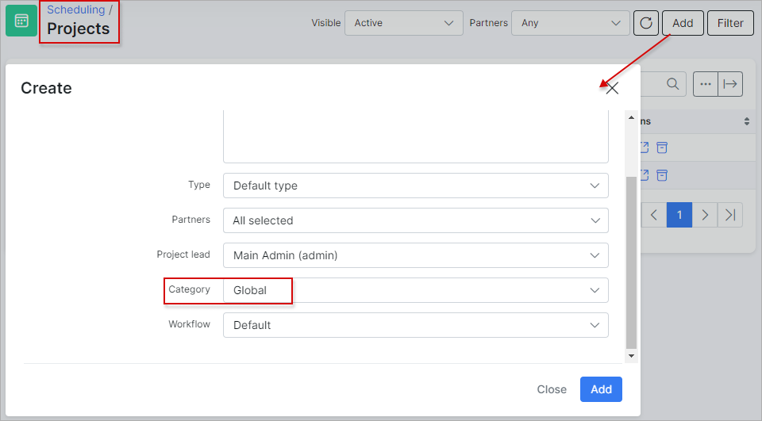

Project categories
=============
In this section we can add, edit or remove project categories.

Navigate to *Config → Scheduling → Project categories*:

Let's add a new category:

Once the category has been added, it can be used when creating a new project:

