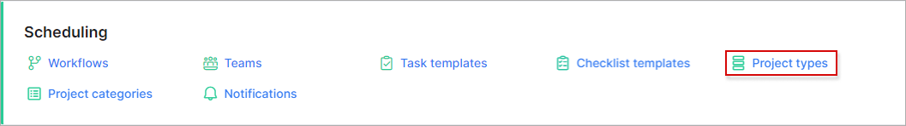
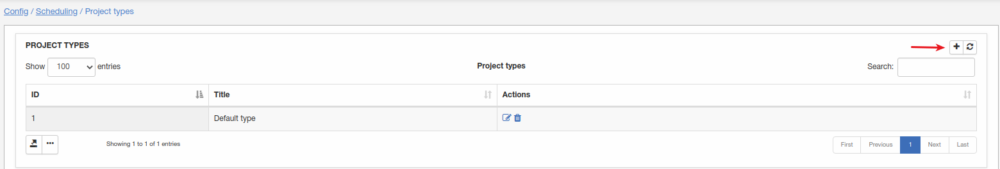
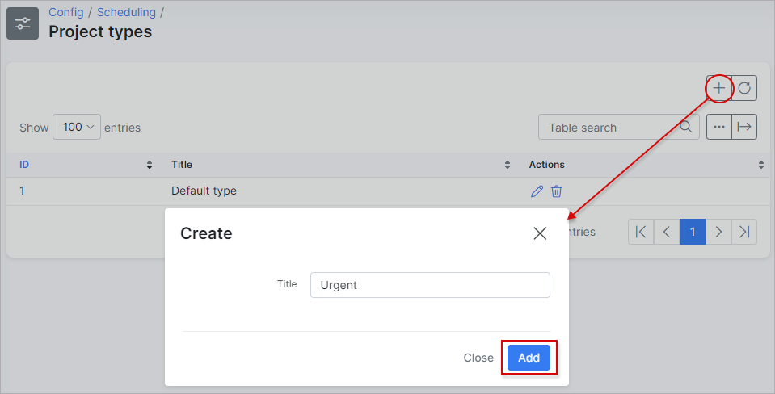
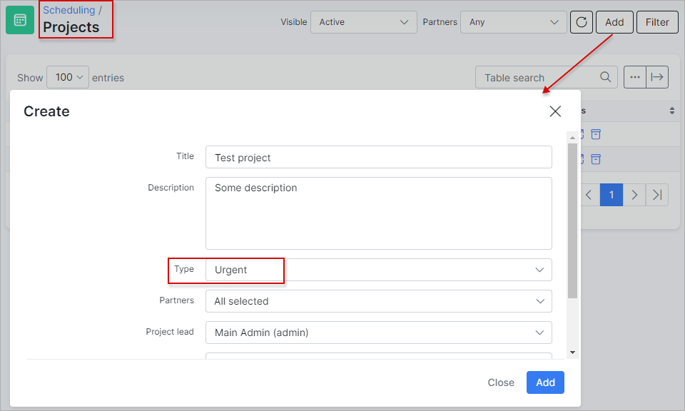

Project types
=============
In this section we can add, edit or remove project types.

Navigate to **_Config -> Scheduling -> Project types_**

Let's add a new project type:

Once the project type has been added, it can be used when creating a new project:

