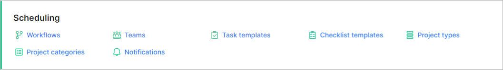

Scheduling
=============
Elements of your scheduling module can be configured here.

Please follow the links for more information on each section:

* [Checklist templates](configuration/scheduling/checklist_templates/checklist_templates.md)

* [Notifications](configuration/scheduling/notifications/notifications.md)

* [Project categories](configuration/scheduling/project_categories/project_categories.md)

* [Project types](configuration/scheduling/project_types/project_types.md)

* [Task templates](configuration/scheduling/task_templates/task_templates.md)

* [Teams](configuration/scheduling/teams/teams.md)

* [Workflows](configuration/scheduling/workflows/workflows.md)
