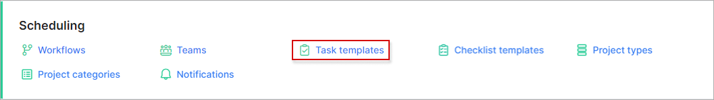
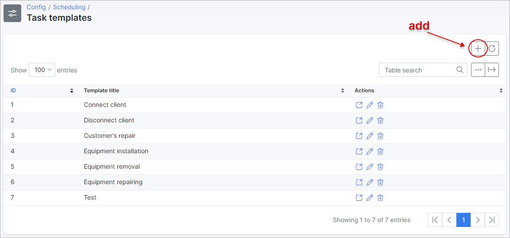
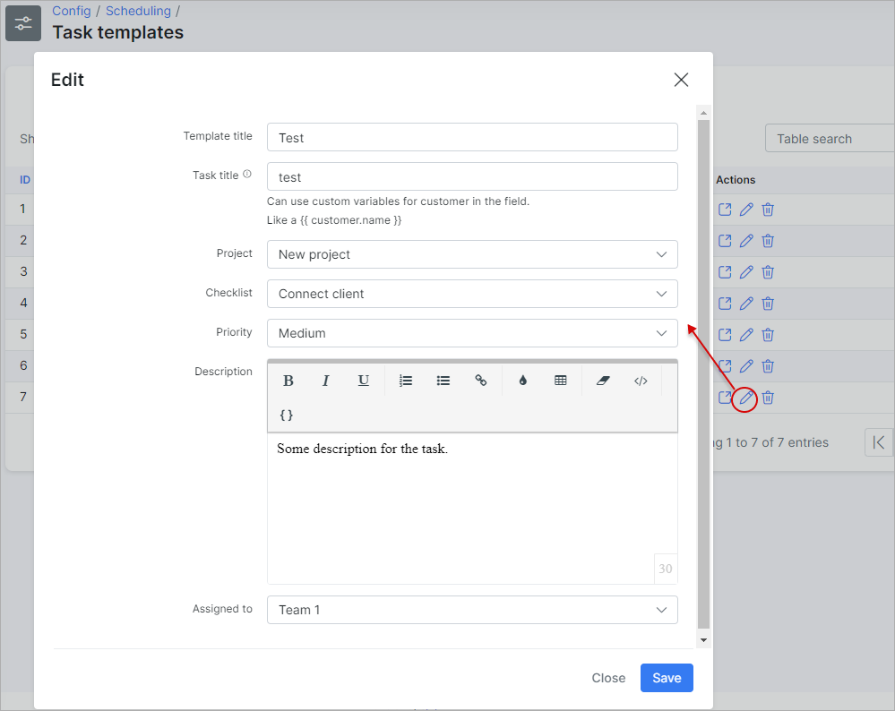
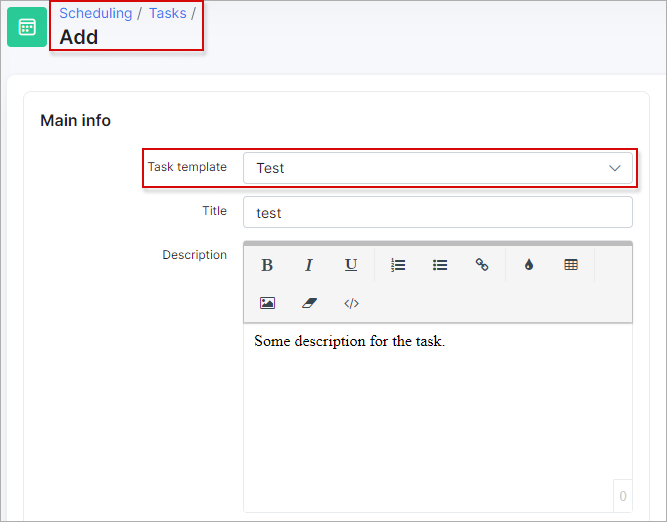

Task templates
=============
In this section we can add, edit or remove task templates.
Task templates are used to speed up task creation, where you can load settings from a previously added task.

Navigate to **_Config -> Scheduling -> Task templates_**

Let's edit task template #13 "test":

Here we've changed the project to use this task template with being only in tasks of the project: "new project", and the checklist "Connect client". We can also add a default description for this task and also automatically assign it to the "Installation team"(the assignee can be changed in the task).

To create a new task from a template, select the template in step 1 and click "Load", in step 2 and the data will be loaded from template.

