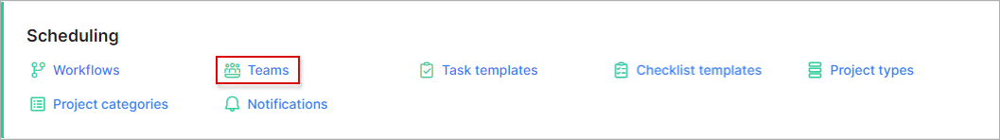
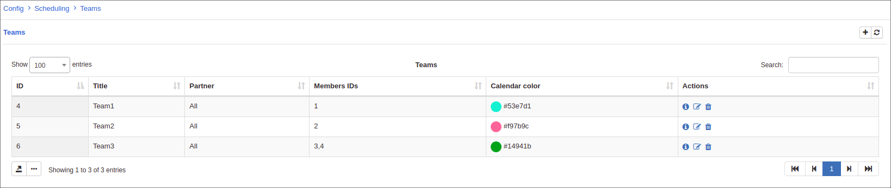
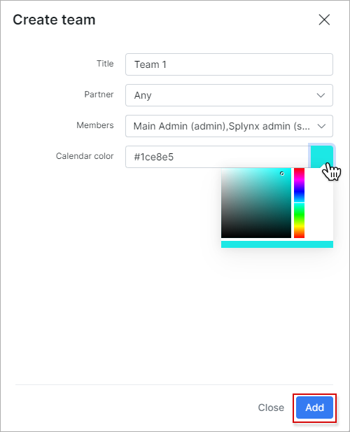
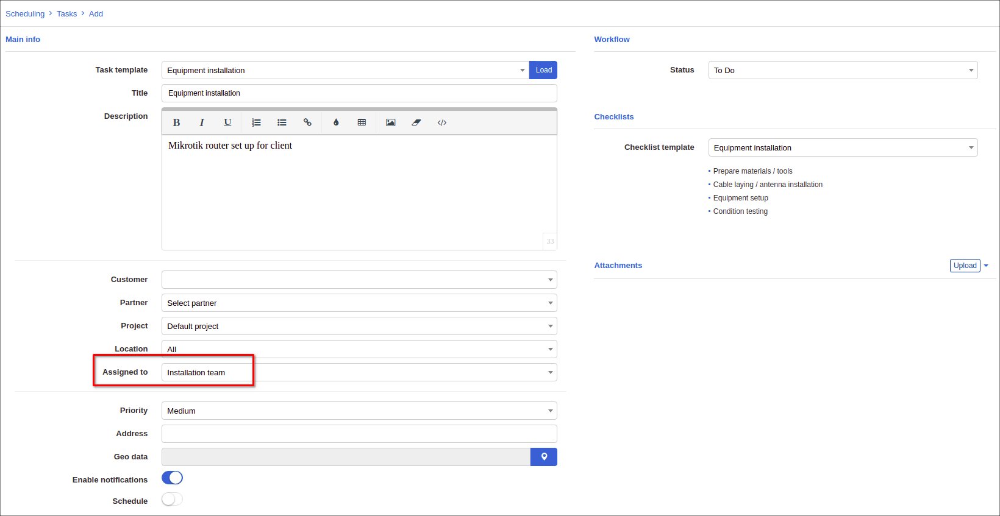

Teams
=============
In this section new teams can be added, changed or deleted.

**_Config -> Scheduling -> Teams_**

Because we have an empty list of teams, tasks can be assigned only to a specific administrator.
Let's add new team:

Select a title for the team, assign partner and administrators who will be in this team.

Once a team has been created, scheduling tasks can be assigned to teams:

