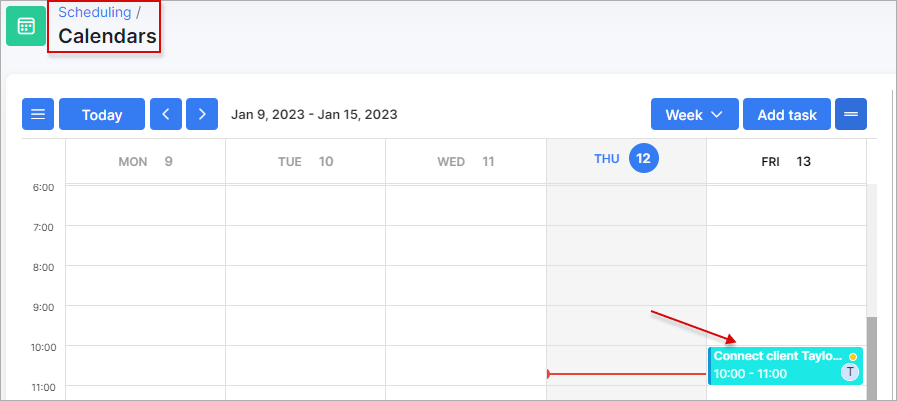

Teams
=============
In this section new teams can be added, changed or deleted.

`Config → Scheduling → Teams`

**Note:** If the teams are not created, the task can be assigned only to a specific administrator.

Let's add new team:

Select a title for the team, assign partner and administrators who will be in this team and its calendar color.

Once a team has been created, scheduling tasks can be assigned to teams:

