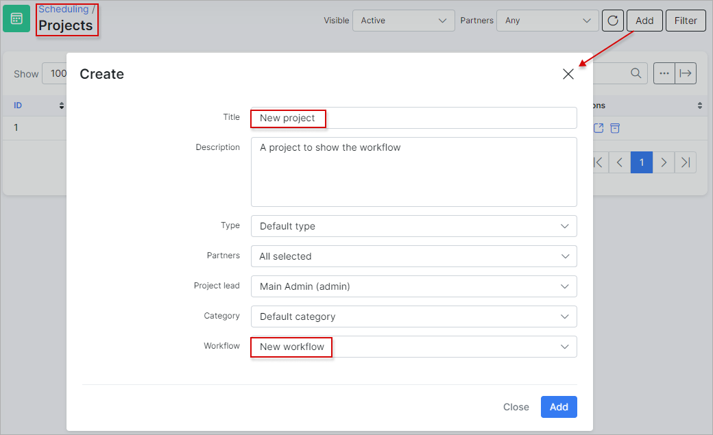

Workflows
=============
In this section a new workflow can be added, changed or deleted.

Let's add a new workflow:

Different statuses can be added to each section ***New***, ***In progress*** or ***Done***.

In this example we have two statuses for the "New" section.

To add a new status, simply click on the `Add status` button. 

<icon class="image-icon"></icon> **Please note that status names have to be unique in the entire workflow.**
_____________________________________________________________________________
Once the new workflow has been added, it can be used in new projects.

Under [Scheduling - Projects](scheduling/projects/projects.md) we've created a project called "New project" and we are going to use this new workflow here.

Once the workflow is selected for a project, navigate to [Scheduling → Tasks → Workflow](scheduling/workflow/workflow.md). Now you can add tasks for this project in the *New project* workflow:

For more information, see also [Tasks](scheduling/tasks/tasks.md).
