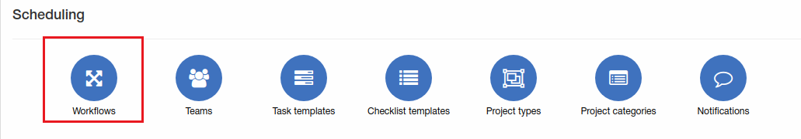
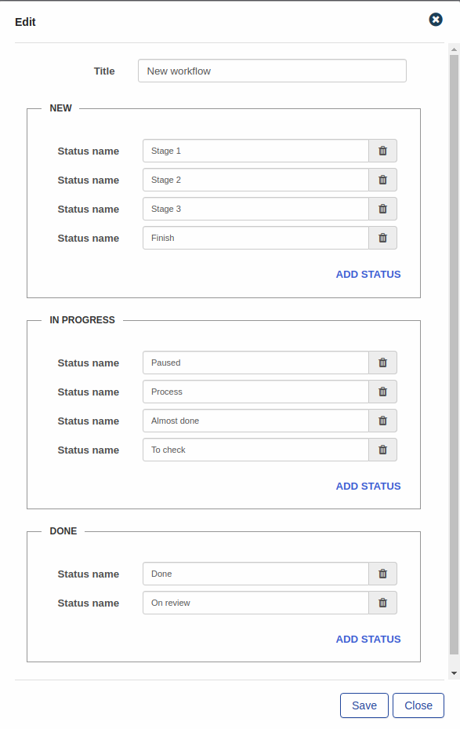
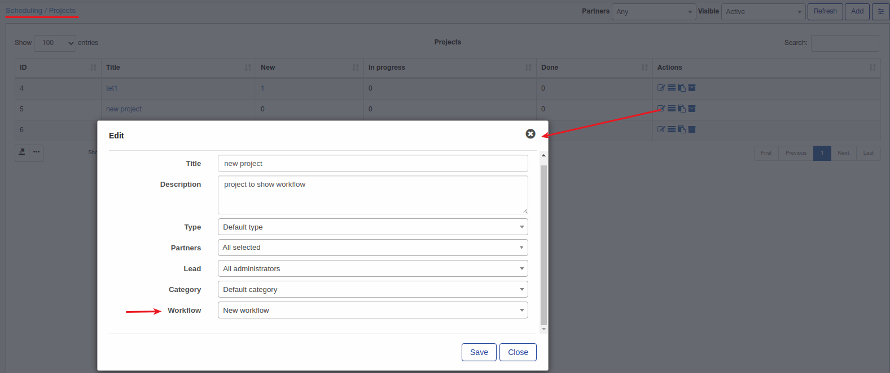
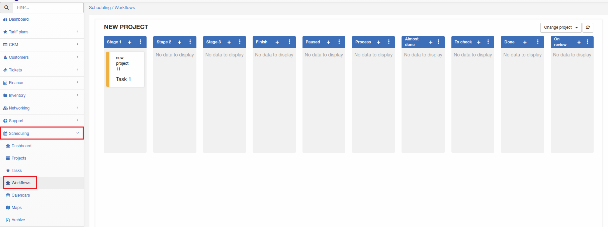

Workflows
=============
In this section new workflows can be added, changed or deleted.

**_Config -> Scheduling -> Workflows_**

Let's add new workflow:

Different statuses can be added to each section "NEW", "IN PROGRESS" or "DONE". In this example we have a few statuses for each section. To add a new status, simply click on the "Add status" **+** button. **Please note that status names must be unique in the entire workflow.**

Once new workflows have been added, it can be used in new projects, under [Scheduling - Projects](scheduling/projects/projects.md) we have a project called "New project" and we are going to use this new workflow here.

Once the workflow is selected for a project, navigate to [Scheduling - Workflows](scheduling/workflows/workflows.md)

We have one [task](scheduling/tasks/tasks.md) in our project and it is on a stage 1 of my workflow.
