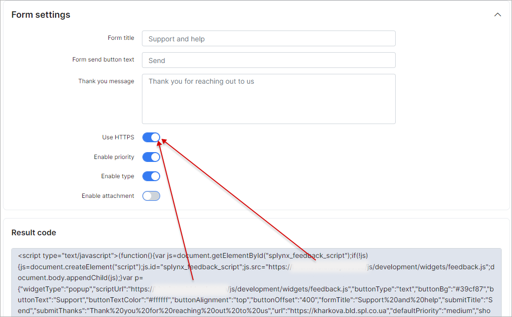

Ticket widget
=============
We have developed the ticket widget which can be placed on company websites for faster communication with Splynx support.

To configure feedback widgets navigate to `Config → Helpdesk → Ticket widget`:

## POP-UP WIDGET

Pop-up widgets can be placed on websites as a small rectangle box somewhere on the page for a quick access. 
The size, color, alignment and form settings can be changed here. The "Use HTTPS" button refers to where your query will be redirected to, so if you have installed HTTPS/SSL on your server, please keep this option enabled. 
Make sure that all changes are applied before using this result code. If something has been changed, the code will be re-generated and you can simply copy and paste it onto your website code.

## EMBEDDED WIDGET

The embedded widget is a similar to the pop-up widget but in other format. Click on the preview to see the result of your code:

