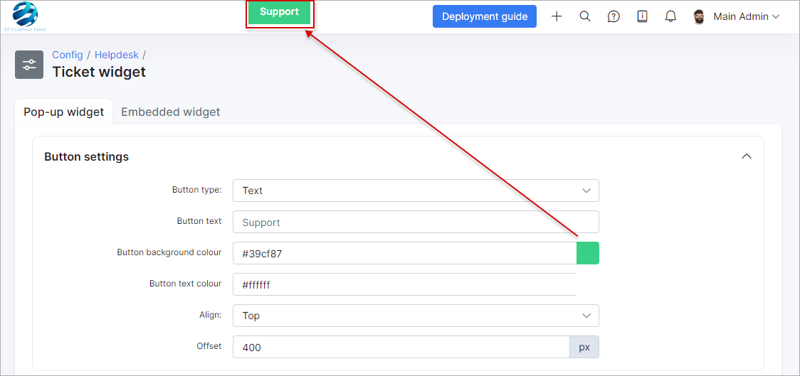

Feedback widget
=============
We have developed feedback widgets which can be placed on company websites for faster communication with Splynx support.

To configure feedback widgets navigate to **_Config -> Support -> Feedback widget_**

## POP-UP WIDGET

Pop-up widgets can be placed on a website as a small rectangle somewhere on the page for quick access.
The size, color, alignment and form settings can be changed here. The "Use HTTPS" button means where to redirect your query, so if you have installed HTTPS/SSL on your server keep this enabled.
Make sure that all changes applied before using this result code. If something is changed, the code will be re-generated and you can simply copy and paste it on your website code.

## EMBEDDED WIDGET

The embedded widget is a similar form to the pop-up widget but in another format. Click on preview to see the result of your code:

