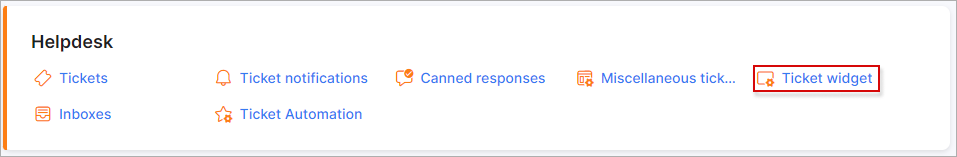

Feedback widget
=============
We have feedback widgets what can be placed to some website for faster contact with Splynx support.

**_Config -> Support -> Feedback widget_**

## POP-UP WIDGET

Pop-up widget can be placed to a website as a small rectangle somewhere as it shown on a screenshot.
Size, color, side, form settings can be changed here. "Use HTTPS" button means where to redirect your query, so if you have installed HTTPS/SSL on your server keep this enabled.
Make sure that all changes applied before using this result code. If something is changed, code will be re-generated and it will be needed to copy and paste it on your website.

## EMBEDDED WIDGET

Similar form but in another format. Click on preview to see the result:

