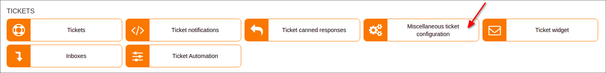
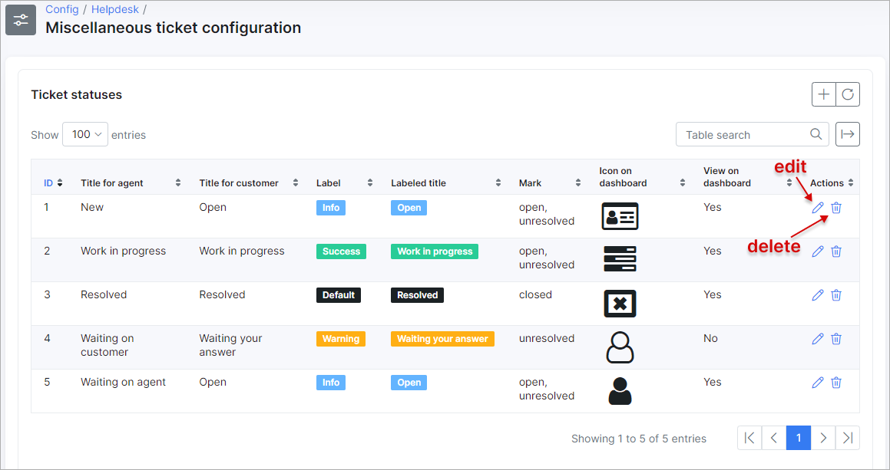
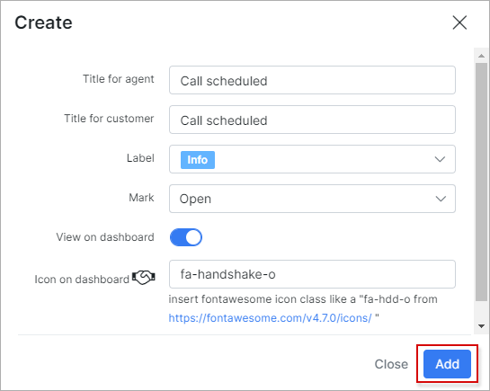
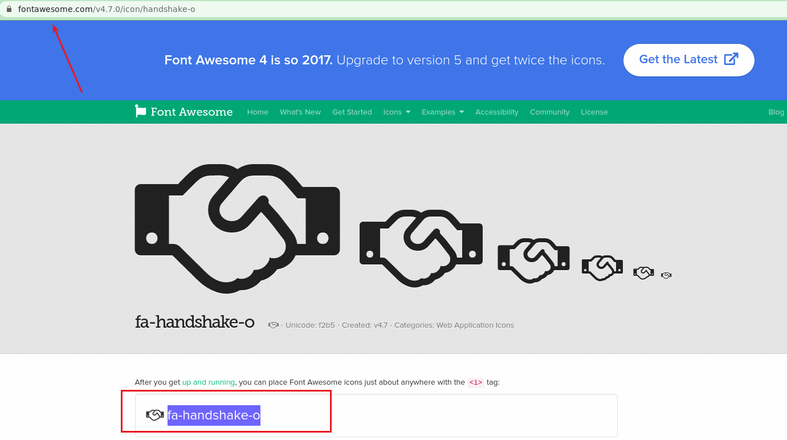
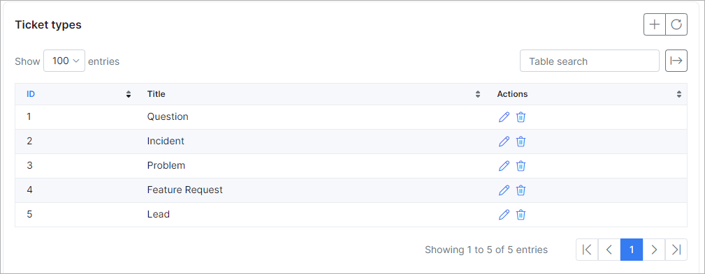
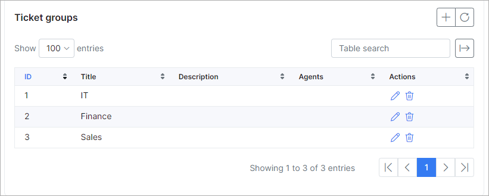
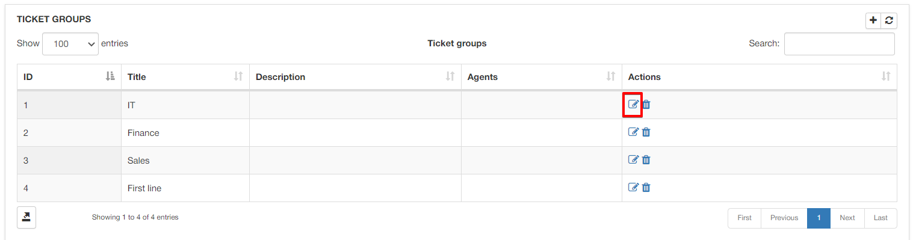
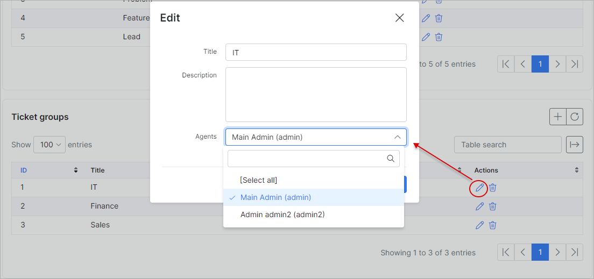
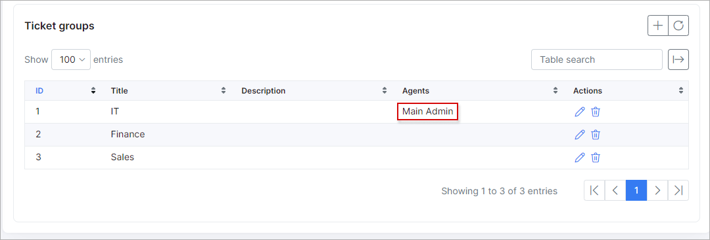
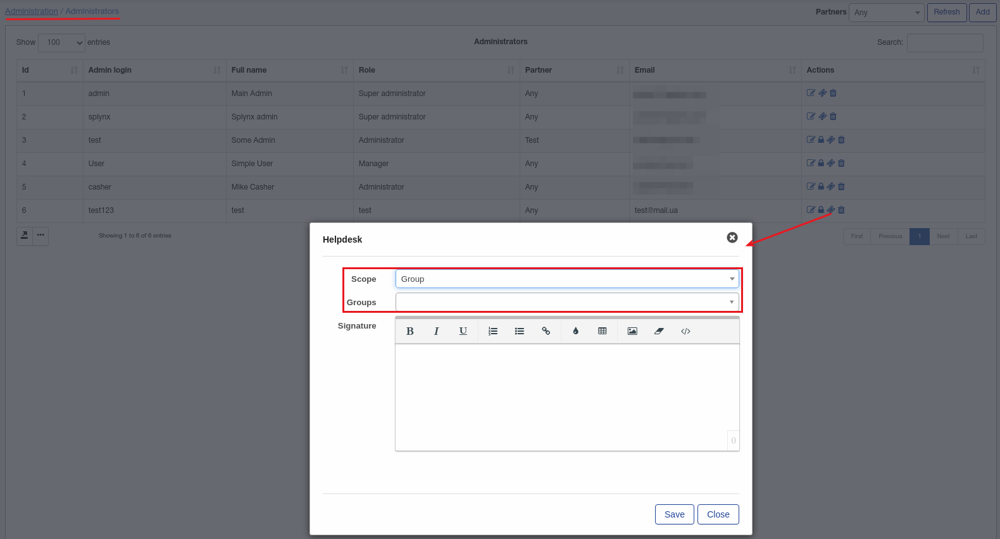

General ticket configuration
=============
In this section ticket statuses, ticket types, and ticket groups can be added/removed or edited.

**_Config -> Support -> General ticket configuration_**

## TICKET STATUSES

Here is a list of default ticket statuses in Splynx, you can change or remove them and add a new status.

In some cases additional statuses are needed, as an example, we will create a status "Call scheduled" which means that an admin will call the customer.

Select a description and a icon if needed. You can use icon codes from the following page:
https://fontawesome.com/v4.7.0/icons/

When a new status is created, it will be available in the statuses list for ticket.

## TICKET TYPES

Ticket types are used to describe the nature of a ticket. For example, it could be an Incident, question, problem or a feature request, etc. You can also configure ticket types to separate which department it is directed to. For example, support, accounts, sales, etc.

To add a new ticket type, simply click on the `"+"` icon at the tope right of the table.

## TICKET GROUPS

Ticket groups are used when your system is configured to assign tickets to specific groups(teams).

To edit a ticket group click on the `"Edit"` button of the group. Here you can select the admins who are in this group and create a relevant description.

We've selected 2 admins to add to the group "IT" which means that if a ticket is assigned to the group, an admin from this group will get this ticket.

It is possible that sometimes an admin from the group didn't get a ticket, but the ticket was assigned to this admin's group. In this case you should check the admin's scope under `Administration -> Administrators -> Helpdesk`:

Make sure that correct group selected here or the Scope is Global.
