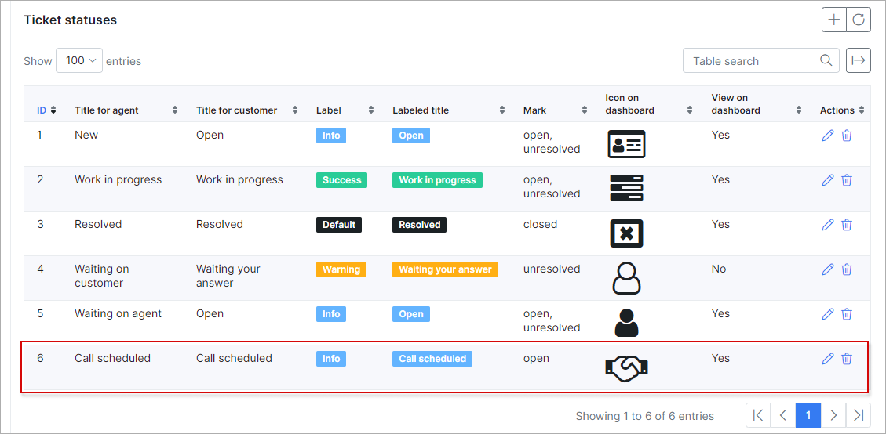
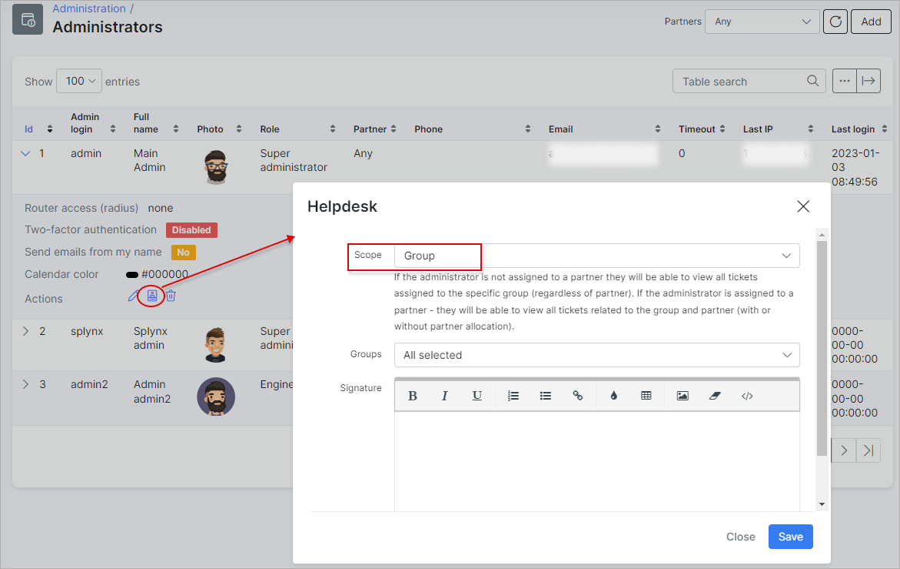

Miscellaneous (general) ticket configuration
=============
In this section, ticket statuses, ticket types, and ticket groups can be added/removed or edited.

`Config → Helpdesk → Miscellaneous ticket configuration`

## TICKET STATUSES

Here is a list of default ticket statuses in Splynx, you can change or remove them and add a new status.

In some cases, additional statuses are needed: as an example, we will create a status "Call scheduled" which means that an admin will call the customer.

Select a description and an icon if needed. You can use icon codes from the following page:
https://fontawesome.com/v4.7.0/icons/

When a new status is created, it will be available in the statuses list for tickets.

## TICKET TYPES

Ticket types are used to describe the nature of a ticket. For example, it could be an Incident, question, problem or a feature request, etc. You can also configure ticket types to separate which department it is directed to. For example, support, accounts, sales, etc.

To add a new ticket type, simply click on the `"+"` icon at the top right corner of the table.

## TICKET GROUPS

Ticket groups are used when your system is configured to assign tickets to specific groups (teams).

To edit a ticket group, click on the `Edit` button of the group. Here you can select the admins who are in this group and create a relevant description.

<icon class="image-icon"></icon> To be able to choose a certain admin from the *Agents* drop-down list for the group, you need first to set the *Scope* for this admin to **Group** under `Administration → Administrators`. Then this admin will become available for all the groups. Specify a certain group in the *Groups* frop-down list, and the admin will be shown only for the chosen group.

We've selected one admin to add to the group "IT" which means that if a ticket is assigned to the group, an admin from this group will get this ticket.

