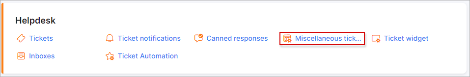
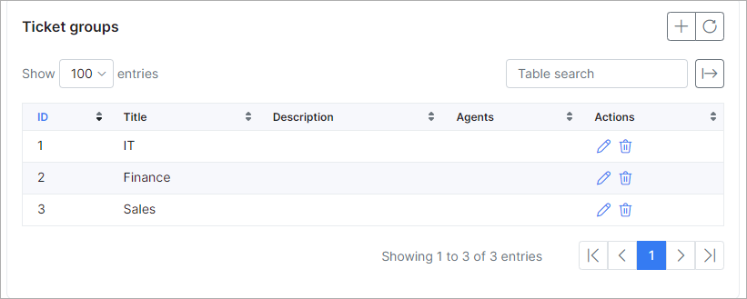
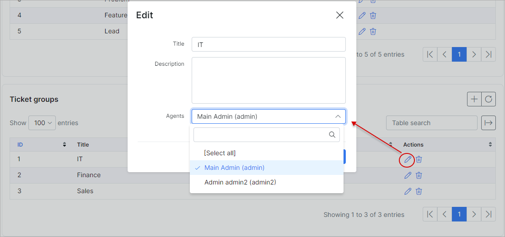
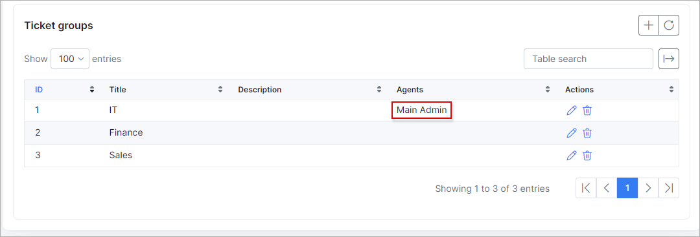

General ticket configuration
=============
In this menu ticket statuses, ticket types, ticket groups can be added/removed or edited.

**_Config -> Support -> General ticket configuration_**

## TICKET STATUSES

Here is a list of default ticket statuses in Splynx, you can change, add or remove them.

In some cases additional statuses needed so as example we will create status "Call scheduled" what means that I admin will call to a customer.

Select description and icon if needed. You can use icon codes from https://fontawesome.com/v4.7.0/icons/ page:

When new status is created it will be available in statuses list for ticket.

## TICKET TYPES

Ticket types can be used for marking tickets depending on departments.

New ticket type can be added by click on "+".

## TICKET GROUPS

Ticket groups are using when your system configured to assign tickets to groups(teams).

To edit group click on "Edit" button near group. Here you can select admins who are in this group and create some description.

I selected 2 admins to group "IT" it means that if ticket will be assigned to group, somebody from this group will get this ticket.

Sometimes it happens that admin from group didn't get a ticket, but ticket was assigned to this admin group. In this case you should check admin scope under Administration -> Administrators -> Helpdesk:

Make sure that correct group selected here or Scope is Global.
