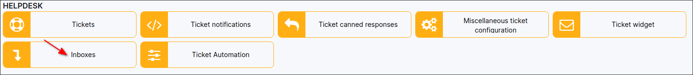
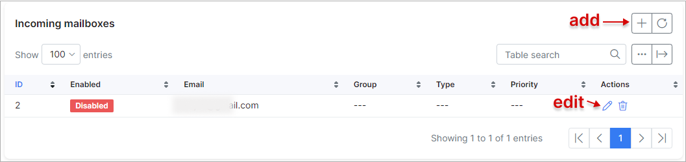
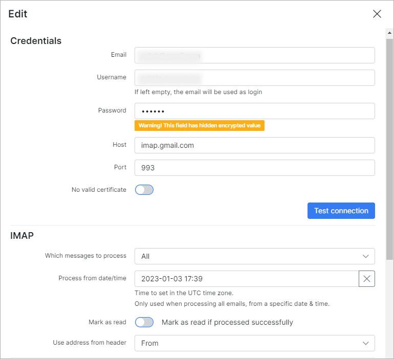
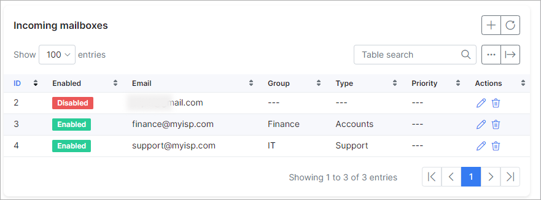
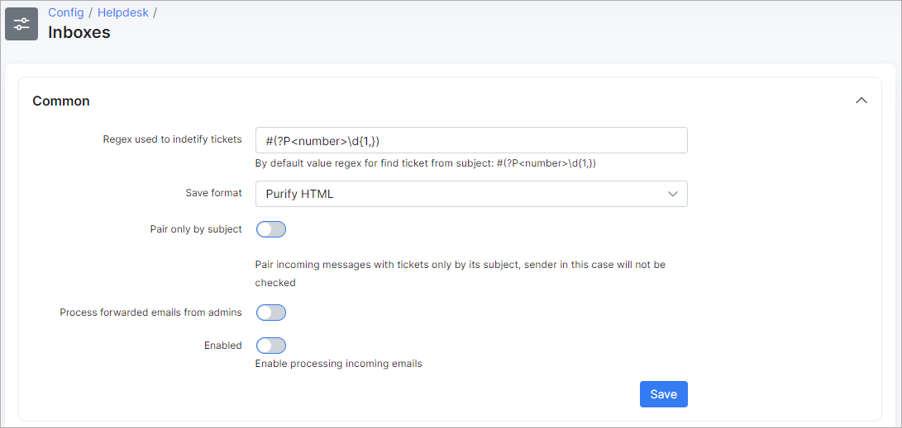
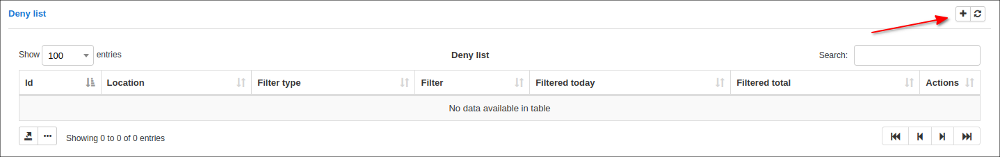

Inboxes
=============

In this section, settings of inboxes(incoming email) can be configured. When a customer  sends a message to the email address of one of the inboxes - a ticket will be created in Splynx.

This feature was developed for faster communication with Splynx support by sending email messages to the support email address instead of logging into the Splynx customer portal to create a ticket.

## INCOMING INBOXES

New inboxes can be added, removed or changed here.
Let's create a new one, simply click on the `"+"` icon on the top left of the table:

We are going to create a new inbox using a gmail email address. IMAP details for gmail can be found on the following page:
 https://support.google.com/mail/answer/7126229?hl=en

When all the credentials have been added, click on "Test connection" to run a test to ensure that the inbox is connected to the gmail account.

### The following parameters can be configured for IMAP settings:

  * **Which messages to process:** "All" or "Unread";

  * **Process from date/time** - here you should specify the date to start email processing. For example, if you select the date as 2020-01-01 00:00:00, Splynx will try to process all emails from this date and create tickets from all these emails;

  * **Mark as read** - mark email what was successfully processed as read in the inbox;

  * **Use address from header** - "From", "Reply to" or "Sender" - means use the address from one of these available fields as the header.

### The following parameters can be configured for Ticket creating:

  * **Receive unregistered emails** - this means, if this option is enabled, tickets will be created from all emails, even if the email address isn't registered in Splynx. If disabled, only customer email addresses can create a ticket from the inbox;

  * **Priority** - select a default priority for ticket new tickets;

  * **Group** - select a default group to assign new tickets to;

  * **Type** - select a default type for new tickets;

And the last option under **"Other"** config, "Enabled" - which enables or disables  creating tickets from this inbox.

We've added a few more inboxes for finance questions and for general support questions.
So if a customer will send a message to finance@myisp.com an "accounts" ticket type will be created and it will be assigned to the ticket group "Finance". Whereas, if message will be sent to support@myisp.com a "Support" ticket type will be created and will be assigned to the group "IT". The Inbox with ID #1 is disabled and we are not using it on our system.

## COMMON

**Regex for find ticket** - value which should be default, if changed it is better to contact Splynx support for assistance;

**Save format** - for now only one option is available "Purify HTML";

**Process forwarded emails from admins** - create tickets from administrators emails;

**Enabled** - this is the global enable/disabled option. Even if there are 5 inboxes with an "Enabled" status, if this option is set to disabled, tickets will not be created.

## BLACKLIST

Email addresses you wish to ignore can be added here. Tickets from these emails will not be created.
